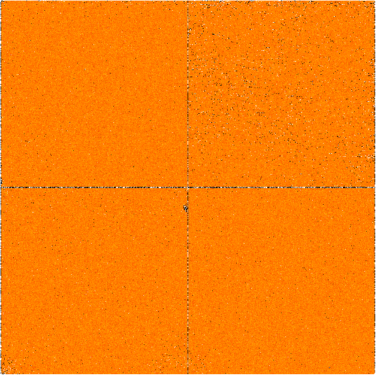

Data description
================
This section gives a description of the raw data produced by PANIC.

The PANIC FITS file contains a primary unit with a common header for the 4 chips
and a data unit with the 4 chips as a whole image, i.e., the 4 chips images are
stuck as a unique image of 4kx4k pixels. Each chip is a 2048x2048 pixels image.
The gap between the chips corresponds to approximately 167 pixels.

HAWAII-2RG_ detectors have an effective surface of 2040x2040 sensitive pixels. 
A 4-pixel wide border is used as reference to correct for relatively slow bias 
drifts; however .....

Beware that the order of the chip in the raw image produced is as described in
next figure:

   

Header
------
The header keywords currently used in a raw PANIC FITS file is as shown bellow::
 
    SIMPLE  =                    T                                                  
    BITPIX  =                   32                                                  
    NAXIS   =                    2 / 2                                              
    NAXIS1  =                 4096                                                  
    NAXIS2  =                 4096                                                  
    BSCALE  =             1.000000                                                  
    BZERO   =             0.000000 / real = bzero + bscale*value                    
    BUNIT   = 'DU/PIXEL'                                                            
    CTYPE1  = 'PIXEL'                                                               
    CTYPE2  = 'PIXEL'                                                               
    CRPIX1  =                  1.0                                                  
    CRPIX2  =                  1.0                                                  
    CRVAL1  =                  1.0                                                  
    CRVAL2  =                  1.0                                                  
    CDELT1  =                  1.0                                                  
    CDELT2  =                  1.0                                                  
    MJD-OBS =         56265.511751 / Modified julian date 'days' of observation end 
    DATE-OBS= '2012-12-04T12:16:55.3177' / UT-date of observation end               
    DATE    = '2012-12-04T12:16:57.5265' / UT-date of file creation                 
    UT      =         44215.317716 / 12:16:55.3177 UTC (sec) at EOread              
    LST     =         23447.900000 / local siderial time: 06:30:47.900 (EOread)     
    ORIGIN  = 'Centro Astronomica Hispano Aleman (CAHA)'                            
    OBSERVER= 'tester'                                                             
    TELESCOP= 'CA 2.2m'                                                             
    FRATIO  = 'F/08'                                                                
    TELLONG =            -2.546250 / degrees                                        
    TELLAT  =            37.222361 / degrees                                        
    TELALT  =          2168.000000 / meters                                         
    INSTRUME= 'Panic'                                                               
    CAMERA  = 'HgCdTe (4096x4096) IR-Camera (4 H2RGs)'                              
    OPTIC   = 'wide field'                                                          
    PIXSCALE=             0.210300 / arcsec/pixel                                   
    ELECGAIN=             4.150000 / electrons/DN                                   
    ENOISE  =            32.000000 / electrons/read                                 
    ELECTRON= 'MPIA IR-ROelectronic Vers. 3'                                        
    WPOS    =                    5                                                  
    W1POS   = 'LDSTOP22'                                                            
    W2POS   = 'POS1'                                                                
    W3POS   = 'POS1'                                                                
    W4POS   = 'POS1'                                                                
    W5POS   = 'POS1'                                                                
    FILTER  = 'dark'         / filter macro name of filter combinations       
    FILTERS = 'OPEN'               / combination of all filters used (single OPEN)  
    STRT_INT=         44212.998498 / '12:16:52.9985' start integration (sec) (UT)   
    STOP_INT=             0.000000 / '00:00:00.0000' stop integration (sec) (UT)    
    RA      =           255.299583 / (deg) R.A.: 17:01:11.9                         
    DEC     =            37.222361 / (deg) Dec.: 37:13:20                           
    EQUINOX =          2012.924896 / (years)                                        
    AIRMASS =             1.000001 / airmass                                        
    HA      =             0.116667 / (deg) H.A. '00:00:28.00'                       
    T_FOCUS =            30.000000 / telescope focus [mm]                           
    CASSPOS =             0.000000 / cassegrain position rel. to NSEW               
    POLPOS  =             0.000000 / polarizer position                             
    NODPOS  = 'A-B (main)'                                                          
    OBJECT  = 'your object'                                                         
    POINT_NO=                    0 / pointing counter                               
    DITH_NO =                    0 / dither step                                    
    EXPO_NO =                    2 / exposure/read counter                          
    FILENAME= 'test.fits'                                                     
    TPLNAME = ''                   / macro/template name                            
    TIMER0  =                 1370 / milliseconds                                   
    TIMER1  =                 2000 / milliseconds                                   
    TIMER2  =               629698 / microseconds                                   
    PTIME   =                    2 / pixel-time-base index                          
    PREAD   =                10000 / pixel read selection (ns)                      
    PSKIP   =                  150 / pixel skip selection (ns)                      
    LSKIP   =                  150 / line skip selection (ns)
    READMODE= 'fast-reset-read.read' / read cycle-type                              
    IDLEMODE= 'wait'               / idle to read transition                        
    SAVEMODE= 'fast-reset-read.read' / save cycle-type                              
    CPAR1   =                    1 / cycle type parameter                           
    ITIME   =             2.000000 / (on chip) integration time [secs]              
    CTIME   =             4.110233 / read-mode cycle time [secs]                    
    CRATE   =             0.243295 / read-mode cycle rate [Hz]                      
    HCOADDS =                    1 / # of hardware coadds                           
    PCOADDS =                    1 / # of coadded plateaus/periods                  
    SCOADDS =                    1 / # of software coadds                           
    NCOADDS =                    1 / effective coadds (total)                       
    EXPTIME =             2.000000 / total integ. time (secs)                       
    FRAMENUM=                    1 / <F_FRAMENUM_CMT>                               
    SKYFRAME= 'unknown'                                                             
    SAVEAREA= '[1:4096,1:4096]'    / lo.left, up.right corner                       
    CHOPP_F =             0.000000 / chopper frequency (Hz)                         
    CHOPP_T =             0.000000 / chopper throw (p-p arcsec)                     
    CHOPP_M = 'DC'                 / chopper mode                                   
    CHOPP_A =             0.000000 / chopper angle (degrees)                        
    CHOPP_P = 'DC: A'              / chopper position in DC-mode                    
    TEMP_A  =             0.000000 / sensor A [K] (-273.15 C)                       
    TEMP_B  =             0.000000 / sensor B [K] (-273 C)                          
    PRESS1  =             0.000000 / [mbar] (0.000e+00 bar) '<<F_PRESS1_NAME>>', 'pr
    PRESS2  =             0.000000 / [mbar] (0e+00 Pa) '<<F_PRESS2_NAME>>', 'pressur
    TEMPMON =                    8 / # of temperatures monitored                    
    TEMPMON1=             0.000000 / [K] (-273.15 C) '<<F_TEMPMONi_TIME>>' '<<F_TEMP
    TEMPMON2=             1.000000 / [K] (-272.15 C) '<<F_TEMPMONi_TIME>>' '<<F_TEMP
    TEMPMON3=             2.000000 / [K] (-271.15 C) '<<F_TEMPMONi_TIME>>' '<<F_TEMP
    TEMPMON4=             3.000000 / [K] (-270.15 C) '<<F_TEMPMONi_TIME>>' '<<F_TEMP
    TEMPMON5=             4.000000 / [K] (-269.15 C) '<<F_TEMPMONi_TIME>>' '<<F_TEMP
    TEMPMON6=             5.000000 / [K] (-268.15 C) '<<F_TEMPMONi_TIME>>' '<<F_TEMP
    TEMPMON7=             6.000000 / [K] (-267.15 C) '<<F_TEMPMONi_TIME>>' '<<F_TEMP
    TEMPMON8=             7.000000 / [K] (-266.15 C) '<<F_TEMPMONi_TIME>>' '<<F_TEMP
    ROTSTAT = 'offline'            / rotator table (rottab)                         
    ROT_TK  =                    0 / rottab: tk                                     
    ROT_TRM =                    0 / rottab: trmode                                 
    ROT_RK  =                    0 / rottab: rk                                     
    ROT_RTA =             0.000000 / rottab: rtangle                                
    ROT_RVA =             0.000000 / rottab: rvangle                                
    ROT_CLM =                    0 / rottab: clmode                                 
    SOFTWARE= 'GEIRS : trunk-r665-g64 (Nov 30 2012, 13:24:05), Panic_r73M'          
    COMMENT = 'your comment'                                                        
    OBS_TOOL= 'OT_V1.0'            / PANIC Observing Tool Software version          
    PROG_ID = ''                   / PANIC Observing Program ID                     
    OB_ID   = '1'                  / PANIC Observing Block ID                       
    OB_NAME = 'OB 1'               / PANIC Observing Block Name                     
    OB_PAT  = 'Calibration Series' / PANIC Observing Block Pattern Type             
    PAT_NAME= 'CS 1'               / PANIC Observing Secuence Pattern Name          
    PAT_EXPN=                    2 / PANIC Pattern total number of expositions      
    PAT_NEXP=                    3 / PANIC Pattern exposition number                
    IMAGETYP= 'DARK'               / PANIC Image type                               
    FIELDTYP=                      / PANIC ID                                       
    SAVETYPE=                      / PANIC Save type                                
    END
                
Data
----
Raw images pixels are coded with 32-bit signed integers (BITPIX=32), however
final reduced images are coded with 32-bit single precision floating point (BITPIX=-32).
The layout of each chip image in a raw image is described above. 

Classification
--------------

Any raw frame can be classified on the basis of a set of keywords read from its header. 
Data classification is typically carried out by the Pipeline at start or by PQL, 
that apply the same set of classification rules. The association of a raw frame 
with calibration data (e.g., of a science frame with a master dark frame) can be
obtained by matching the values of a different set of header keywords.
Each kind of raw frame is typically associated to a single PAPI pipeline recipe, 
i.e., the recipe assigned to the reduction of that specific frame type. In the 
pipeline environment this recipe would be launched automatically.
In the following, all PANIC raw data frames are listed, together with the 
keywords used for their classification and correct association. 

.. _astromatic: http://www.astromatic.net/
.. _sextractor: http://www.astromatic.net/software/sextractor
.. _scamp: http://www.astromatic.net/software/scamp
.. _swarp: http://www.astromatic.net/software/swarp
.. _HAWAII-2RG: http://w3.iaa.es/PANIC/index.php/gb/workpackages/detectors

