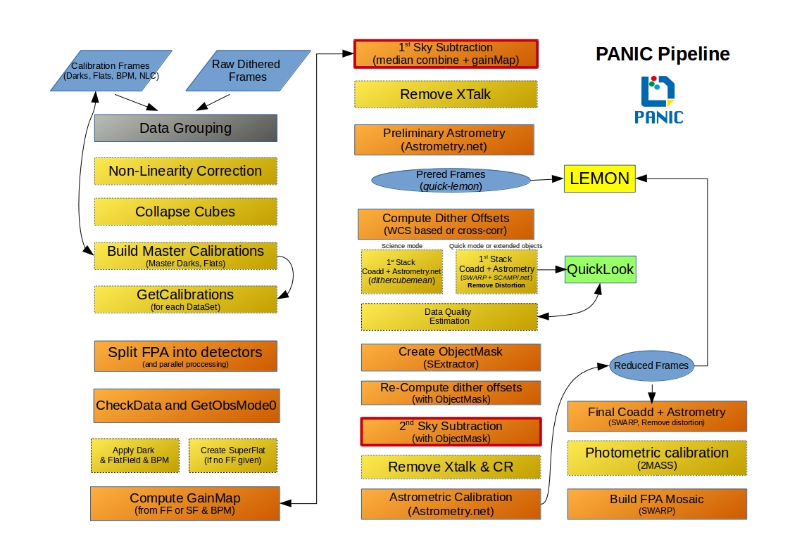

**********************
Processing description
**********************
This section gives a description of each step of the pipeline in a greater 
detail and list the parameters that can be changed if needed.

Next figure shows the main steps that are involved in the PANIC pipeline:

Outline
-------

    * the cross-correlation among the quadrants is corrected;
    * a master flat-field in computed by combining all the appropriate images without offsets; if the mosaic is of an Sky-Target type, only the sky frames are used;
    * a bad pixel mask, is computed by detecting, in the master flat field, the pixels with deviant values;
    * if provided, an external bad pixel mask is also used, adding the bad pixel in the two lists;
    * for each image, a sky frame is computed by combining a certain number of  the closest images; 
    * this sky frame is subtracted by the image and the result is divided by the master flat;
    * bright objects are detected by SExtractor in these cleaned images to measure the offsets among the images; the object mask are multiplied by the bad pixel mask to remove false detections;
    * a cross-correlation algorithm among the object masks is used to  measure the relative offsets. It also works if no object is common to all the images; 
    * the cleaned images are combined using the offsets, creating the "quick" image;
    * to remove the effect of faint obejcts on the estimate of the sky frames, SExtractor is used on the combined image to create a master object mask;
    * the object mask is dilatated by a certain factor to remove also the undetected object tails;
    * for each image a new sky is computed by taking into account this object mask;
    * if field distortion can be neglected, these images are combined by using the old offsets, creating the "science" image;
    * field distortion is removed from the cleaned images by using SCAMP computed distortion model
    * the pixels containing deviant pixels are identified and flagged;
    * the old offsets could be effected by field distortion, therefore new offsets are computed for the undistorted images;
    * finally, the cleaned corrected images are combined.

Main configuration file
***********************
 

Image selection
***************

Data-set classification
***********************

One of the main features of PAPI is that the software is able to do an Automatic
Data Reduction. While most of the pipelines are run interactively, PAPI is able
to run without human interaction. It is done because of the classificaton algorithm
that is implemented in PAPI and that allow an automatic identification of the 
data sets grouping the files according to the observation definition with the OT.

1-The data grouping algorithm
2-Sky finding algorithm for extended objects

In case of not using the OT during the observation, also a data grouping is possible,
althouth with some limitations. Let's see how it works:

[...]

Calibrations
************

Computing the master dark
-------------------------

Computing the master flat-field
-------------------------------

Computing the Bad Pixel Mask
----------------------------

First pass sky subtraction
**************************

Sky model
---------

Object detection
****************

Offset computation
******************

First pass coaddition
*********************

Master object mask
******************
Sextractor_ is again used to find objects in this first-pass coadded image in 
order to mask then during next sky estimation. This time the parameters controlling
the detection threshold should be set to have deeper detections and mask faint
objects. The parameters involved nad ther default values are:

mask_minarear = 10
mask_thresh = 1.5

The resulting object mask is extended by a certain fraction to reject also 
the undetected object tails. 
  

Crosstalk
*********
Crosstalk can in general be corrected well, provided that it is spatially stable. 
The latter is not always the case for near-IR detector arrays. In particular 
recent HAWAII2 sensors with multiple parallel readout sections can show crosstalk 
in form of compact positive and negative ghost images whose amplitude varies between 
readout sections. PAPI has a optional de-crosstalk module that assumes that the 
amplitude is the same, therefore the correction will only partially remove the 
effect (if at all). If you know in advance that this will be a problem for your 
science case, then consider choosing different camera rotator angles for your observations.

Extended Objects
****************
If your targets are really extended and/or very faint, then you should seriously 
consider observing blank SKY fields. They will be recognized and automatically 
used in the correct manner once identified by PAPI. No additional settings 
have to be made. You should check though that the images have correct header keys.

.. _astromatic: http://www.astromatic.net/
.. _sextractor: http://www.astromatic.net/software/sextractor
.. _scamp: http://www.astromatic.net/software/scamp
.. _swarp: http://www.astromatic.net/software/swarp
.. _HAWAII-2RG: http://w3.iaa.es/PANIC/index.php/gb/workpackages/detectors

