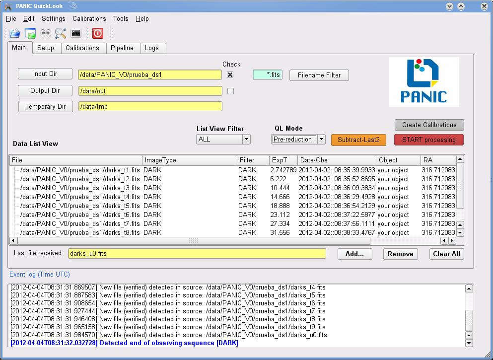

PANIC Quick-Look Tool (PQL)
===========================
The PANIC Quick-Look ((hereafter PQL) will  perform some on-line data processing 
for quick-look or quality check of the data being acquired, taking a close look 
at a raw near-infrared image and getting a quick feedback of the running observation.

The PQL is an application with a graphical user interface which monitors the 
GEIRS data output, waiting for new FITS files coming from GEIRS. When a new file 
is detected, it is added to the file list view in the main panel, and then the 
PQL will perform the task previously specified by the user in the setup 
configuration. Some of the available tasks are:

   * Only display the FITS image with no processing
   * Dark subtraction, flat division
   * Sky subtraction (using N-nearest frames or own sky )
   * Field distortion removal
   * Image align and stacking
   * Preliminary astrometric solution
   * Preliminary photometry

In addition, the PQL allows the user to execute manually in an interactive way 
some tasks with the data. For example, he user will be able to select a file, 
compute some statistics values (background, FWHM, min, max, …) or ask for the
sky subtraction looking for the nearest N frames around the selected one. Other 
option available is to select a set of files and request a shift and align of 
them.

The PQL can be operated in both near-real time mode and offline mode (all data files
already stored in the disk), although its functionalities have been provided 
mainly in near-real time to check the status and progress of the observation 
during the night. 

The next figure shows a snapshot of the PQL:
  

   

.. index:: quick-look, running

Running on-line
***************

Running PQL can be as simple as executing the following command in a terminal::
	
	> ./runPQL.py [-C config_file ] [-s raw_data ] [-o result ] 

Where ``config_file`` is the configuration file to be used (see bellow),
``raw_data`` is the directory of the raw dataset (uncalibrated) having 
both science or calibration files, and ``result`` is the path to the directory 
where the calibrated data produced by the QL will be saved.  

If no option is specified for launch the PQL, it will look for the default 
configuration file and run with the configuration on it.

.. index:: config, quicklook, papi, on-line

Running off-line
****************
Run PQL in off-line mode means that data were already taken and are in a specific
directory that we wish to inspect in quick way.
In order for working in off-line mode, yoy

.. index:: config, quicklook, off-line

Optional Commands
*****************

Here's a listing of the PQL command line options::

   Usage: runQL.py [OPTION]... DIRECTORY...

   This module in the main application for the PANIC Quick Loook (PQL) data
   reduction system
   
   Options:
     --version             show program's version number and exit
     -h, --help            show this help message and exit
     -c CONFIG_FILE, --config=CONFIG_FILE
                           config file for the PANIC Pipeline application. If not
                           specified, './config_files/papi_portatil.cfg' is used
     -v, --verbose         verbose mode [default]
     -s SOURCE, --source=SOURCE
                           Source directory of data frames. It has to be a
                           fullpath file name
     -o OUTPUT_DIR, --output_dir=OUTPUT_DIR
                           output directory to write products
     -t TEMP_DIR, --temp_dir=TEMP_DIR
                           temporary directory to write
      
   
   
	
.. index:: quicklook, off-line, on-line, configuration

.. _troubleshooting:

Troubleshooting
***************

*Add tips here*