.. _pql:

PANIC Quick-Look Tool (PQL)
***************************

Purpose
=======

PANIC Quick-Look (hereafter PQL) performs some on-line data processing 
for quick-look or quality check of the data being acquired, taking a close look 
at a raw near-infrared image and getting a quick feedback of the running observation.

PQL is an application with a graphical user interface which monitors the 
GEIRS data output, waiting for new FITS files coming from GEIRS. When a new file 
is detected, it is added to the file list view in the main panel, and then 
PQL will perform the task previously specified by the user in the setup 
configuration. Some of the available tasks are:

   * Only display the FITS image with no processing
   * Dark subtraction, flat division
   * Sky subtraction (using N-nearest frames or own sky )
   * Field distortion removal
   * Image align and stacking
   * Preliminary astrometric solution
   * Preliminary photometry

In addition, PQL allows you to execute manually in an interactive way 
some tasks with the data. For example, you will be able to select a file, 
compute some statistics values (background, FWHM, min, max, …) or ask for the
sky subtraction looking for the nearest N frames around the selected one. Other 
option available is to select a set of files and request to shift and align them.

PQL can be operated in both near-real time mode (during the observation) and
offline mode (after the observation, with all data files already stored in the disk);
however, its functionalities have been provided mainly in near-real time to check 
the status and progress of the observation during the night. 

The visualization application used to display the images is SAOImage ds9_, which 
supports FITS images, multiple frame buffers, region manipulation, and many 
scale algorithms and colormaps.

.. index:: quick-look, running

.. _fits_headers:

FITS files and headers
======================

PQL **only** supports FITS_ (Flexible Image Transport System) with two-dimensional 
image formats. Due PANIC has a FPA of four detector, the FITS files can be ``Single Extension FITS (SEF)`` 
or ``Multi-Extension FITS (MEF)``, however MEF are prefered.

The complete definition of the FITS headers can be found on the GEIRS_ documentation.

For general purpose, such as viewing and simple analysis, only minimal headers
keywords are required. However, and in order to group and reduce observing sequences, 
the following header keywords are also required::

    OBS_TOOL= 'OT_V1.1 '           / PANIC Observing Tool Software version          
    PROG_ID = '        '           / PANIC Observing Program ID                     
    OB_ID   = '6       '           / PANIC Observing Block ID                       
    OB_NAME = 'OB CU Cnc Ks 2'     / PANIC Observing Block Name                     
    OB_PAT  = '5-point '           / PANIC Observing Block Pattern Type             
    PAT_NAME= 'OS Ks 2 '           / PANIC Observing Secuence Pattern Name          
    PAT_EXPN=                    1 / PANIC Pattern exposition number                
    PAT_NEXP=                    5 / PANIC Pattern total number of expositions      
    IMAGETYP= 'SCIENCE '           / PANIC Image type                         

These keywords are automatically added to the FITS header by the PANIC Observation Tool,
as each file is created. If these are not saved, PQL will not work correctly.

Starting PQL
============

To start PQL GUI, you can lauch it from the PANIC computer (panic22/panic35) once you are
logged as obs22/obs35 user. Thus, as any one of the workstations of the observing room,
open a X terminal window and log into the PANIC computer as follow:
  
for 2.2m::

    $ ssh -X obs22@panic22 
    (ask Calar Alto staff for password)
   
for 3.5m::

    $ ssh -X obs35@panic35 
    (ask Calar Alto staff for password)
   
Once you are logged into the PANIC computer, to launch PQL GUI type next command::

    $ start_ql &
    
The next figure shows a snapshot of the main window of PQL GUI that will bring up the *start_ql* command.
  
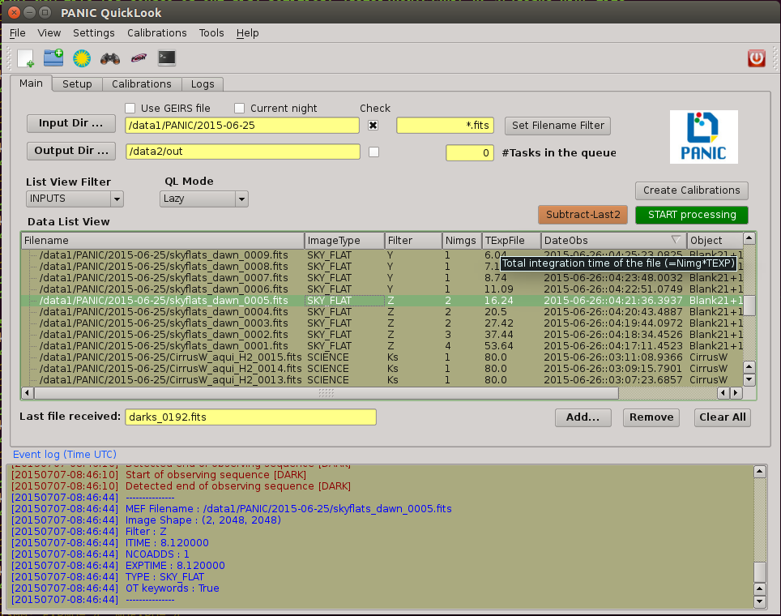

.. _configuration_file:

Configuration files
===================

The configuration files used by PQL are located in the $PAPI_HOME/config_files.
The main config file is the same file used by PAPI, ie., $PAPI_CONFIG, and usually
called papi.cfg. 

This file includes a lot of parameters used by PAPI, and therefore by 
PQL during the processing; however at the end of the $PAPI_CONFIG file there is section 
called `quicklook`, where the user can set some specific parameters for PQL::

    ##############################################################################
    [quicklook]
    ##############################################################################
    # Next are some configurable options for the PANIC Quick Look tool
    #
    # some important directories
    #
    source = /data1/PANIC/
    output_dir = /data2/out   # the directory to which the resulting images will be saved.
    temp_dir = /data2/tmp    # the directory to which temporal results will be saved
    verbose = True

    # Run parameters
    run_mode = Lazy # default (initial) run mode of the QL; it can be (None, Lazy, Prereduce)

Although the user can edit these values in the config file, some of them can be set easily
on PQL's GUI. 

For the complete list of the parameters available on the $PAPI_CONFIG file, see :ref:`Main config file <config>` section.

PQL's main window
=================

PQL Main window contains a Menu bar (1), Tool bar (2), four Tabbed panels (3) and 
an :ref:`Event Log Window <event_log_window>` (4).
Images are displayed in an external well-known application, ds9_. Plots results are displayed in 
the additional windows, usually generated by matplotlib than can be copied to the clipboard, 
printed or saved.

Menu bar
--------

The menu bar provides acces to some PQL's capabilities.

1. File
2. View
3. Settings
4. Calibrations
5. Tools
6. Help
  Opens a web browser which shows an on-line HTML version of this user's manual. This will fail 
  if the internet conection or proxy is not correctly configured.
7. Exit
  Quit PQL application.

Tool bar
--------

The tool bar duplicates some of the options available from the menu bar or the pop-up menu. 
Currently, there are several buttons which provide quick access to change the most frecuently-used PQL actions:

- add a file to the current view
- change the source input directory: the same that :ref:`Input directory <input_directory>`.
- display the current selected image: the same that :ref:`Display <display>`.
- open an IRAF_ console
- open Aladin_ tool
- quit PQL (on the right border)

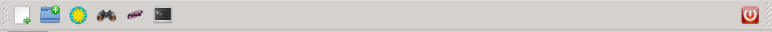
   

Main panel
----------
This tab panel contains the following controls:

- Input directory
- Ouput directory
- Filename filter
- Current night
- Use GEIRS file
- Data list view
- List view filter
- QL mode
- 'Subract last-2' button
- 'START processing' button
- 'Create Calibrations' button

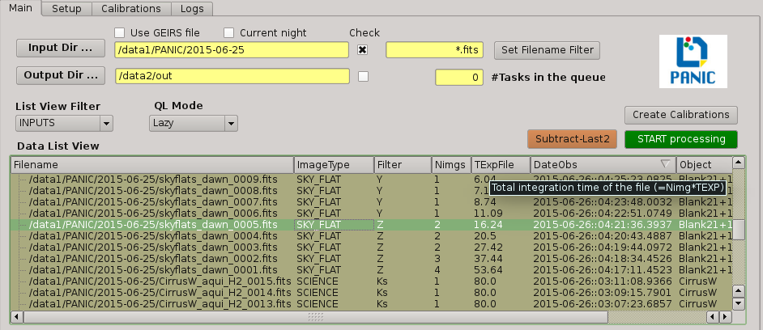

Data directories
^^^^^^^^^^^^^^^^

In the 'Main' tab panel of PQL main window, the fitst thing to set up are the data directories:

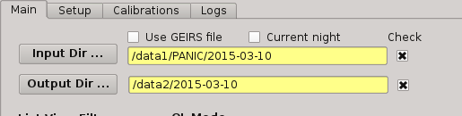

.. _input_directory:

Input directory
^^^^^^^^^^^^^^^

This is where you tell PQL where the data are or being saved by GEIRS. This directory is specified
at the beggining of the night on the Observation Tool. PQL requieres all data to lie in some main 
directory, not being required to distribute the files in individual sub-directories for darks, flats,
and science images. It is advised that this directory follow the next format::

    /data1/PANIC/YYYYMMDD

To set the value, the user must push the 'Input Dir' button:

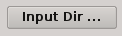

Note that the value in this field has only effect when the checkbox on the right is clicked.

Output directory
^^^^^^^^^^^^^^^^

This is where you tell PQL where the data generated by PQL, as result of some processing, will be saved.
This directory must also be specified at the begining of the night, and is advised to follow the next format::

   /data2/out/YYYYMMDD
  

To set the value, the user must push the 'Output Dir' button:

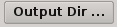

Note that the value in this field has only effect when the checkbox on the right is clicked.

Temporal directory
^^^^^^^^^^^^^^^^^^

This is where you tell PQL where the temporal files generated by PQL, as result of some processing, 
will be saved, and probably deleted after at the end of that processing.
This directory must also be specified at the begining of the night, and is advised to follow the next format::

   /data2/tmp/YYYYMMDD

To set the value, the user must push the 'Temporary Dir' button than appears on the 'Setup' tab, 
instead the 'Main' tab used for input and output directory.

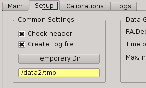
   

Current night checkbox
----------------------

When you click this checkbox, the `Input directory` and `Output directory` fields will be automatically filled
with the currect night date. If the current night Input/Ouput directories donot exist, PQL will ask you if you want
to create them.

The currect night is supposed to start at 8 am (UTC) and to end at 8 am (UTC) of next day.

Use GEIRS file
--------------

When this checkbox is clicked, PQL will use the ~/tmp/fitsGeirsWritten file to detect the new files created by
GEIRS. Files older than 1 day, will no be considered. 

This detection method for FITS files is not frecuently used, but can be useful 
whether some problem arise reading files just after they have been written by GEIRS.

Filename filter 
---------------

In this box, the user can filter the name of the files should appears on the data list view 
from the input directory (output files are not filtered).
The filter can contains '*' and '?' wildcards. 

For example:

    `*March10_00?1*`

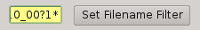

.. _data_list_view:

Data list view
--------------

Tha data list view control displays all the files found in the input directory, or in the output directory 
if the check box at the right of output directory is checked. Additionaly, the use can add any other FITS file.
The control is a multicolum table with the next fields:

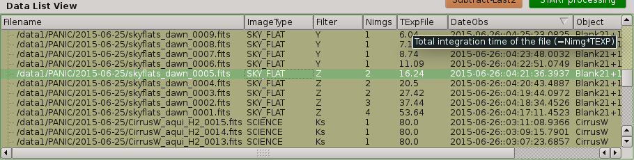

Filename
  Full path name of the file found in the 
Image type
  The type of the FITS file detected: DARK, DOME_FLAT, SKY_FLAT, FOCUS, SCIENCE 
ExpT
  Exposition time of the file (EXPTIME keyword)
Date-Obs
  Observation data of the file (DATE-OBS keyword)
Object
  Object name (OBJECT keyword)
RA
  Right ascention of center of the image.
Dec
  Declination of the cener of the image.

You can sort the list by any column (filename, image type, exptime, filter, 
date-obs, object, right ascension, declination) by clicking on their 
headers, as usual; by default, the list is sorted by the Date-Obs field, 
showing the most recect file at the top.

A double-click on any row displays all its file into SAOImage ds9_.

For further details of any of the files, you can also look at the header of a fits image using 
ds9 using the "File/Display Fits Header..." menu option.

.. _list_view_filter:

List view filter
----------------
It allows you to select the type of files to be shown in the data list view. 
The options are:

INPUTS
  Files of the input directory
OUTS
  Files of the ouput directory
DARK
  Files marked (IMAGETYP) as DARK images
DOME_FLAT
  Files marked as DOME_FLAT image  
FOUCS
  Files marked as FOCUS image from a focus series
SKY_FLAT
  Files marked as SKY_FLAT images
SCIENCE
  Files marked as SCIENCE image or with unknown type.
MASTERS
  Files marked as MASTER calibration files produced by PAPI
REDUCED
  Files marked as calibrated by PAPI
GROUP
  Special case that show all the files groupped as observed sequences (OBs)
ALL
  Show all the files, not matter the type of it
  
 
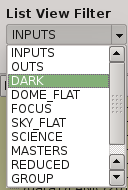

.. _quicklook_mode:

QuickLook mode
--------------

The quick look mode combo box allows you to select the mode in which PQL 
will be run when the **START processing** button is pushed.
The current modes are:

None
  No processing action is done

Lazy (**default**)
  If the end of a calibration (DARK, FLAT) sequence is detected, the master 
  file is built. Otherwise, and the SCIENCE files are processed as specified 
  in the 'Setup->Lazy Mode':
  
  + Apply DARK + FLAT + BPM
  + Subtract Last Frame (Science)
  + Subract Nearest Sky

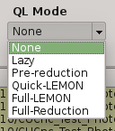

  
Pre-Reduction
  If the end of observing sequence is detected, it is processed in a quick mode (single pass for sky subtraction). 
  For calibration sequences, the master file will be built, and for science sequences, a quick 
  reduction will be done using options configured in the 'Setup->Pre-Reduction Mode' and the 
  calibrations found in local database (output directory and external calibration directory).
  Note that the pre-reduction options configured in the config file will be overwritten.
  
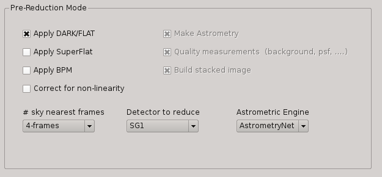
  
Quick-LEMON
  The same as Pre-reduction, but the processing stops after the 1st sky subtraction, and 
  no final co-added image is produced. It is useful for LEMON_ processing for light curves.

Full-Reduction
  If the end of observing sequence is detected, it is processed in a *science* mode (double pass for sky subtraction). 
  For calibration sequences, the master file will be built, and for science sequences, a *science* 
  reduction will be done using options configured in the 'Setup->Pre-Reduction Mode' and the 
  calibrations found in local database (output directory and external calibration directory).
  Note that the pre-reduction options configured in the config file will be overwritten.

Full-LEMON
  The same as Pre-reduction, but the processing stops after the 2nd sky subtraction, and 
  no final co-added image is produced. It is useful for LEMON_ processing for light curves.

Last file received
------------------
This field shows the last file received (detected) by PQL.

Buttons
-------

Subract-last2 button
^^^^^^^^^^^^^^^^^^^^
It will produced a new image as result of the subtraction of last two images received.

Create calibrations button
^^^^^^^^^^^^^^^^^^^^^^^^^^

This button will start the processing of all the **calibration**
sequences received. As result, a list of master calibrations (combined darks or flats) will be generated
in the output directory. 

START button
^^^^^^^^^^^^

This button starts the processing of **all** the sequences received. You will be 
asked whether to proccess all the current images or only the new ones. 
As result, a list of master calibrations and science calibrated images will be generated
in the output directory. 

Add button
^^^^^^^^^^
This button allows to add manually a single file to the :ref:`Data List View <data_list_view>` 
from wherever the file is.

Remove button
^^^^^^^^^^^^^
This button removes manually from the :ref:`Data List View <data_list_view>` the currently 
selected file, but it does not remove neither from the local database nor the file system.

Clear All button
^^^^^^^^^^^^^^^^
It removes all the current files from the :ref:`Data List View <data_list_view>`, 
but they will not be removed from the file system. As result, it will empty the *Data List View* 
until a new input directory is selected or a new file is detected in the current one.

Setup Panel
-----------
This panel allows the user to set some of the parameters used for the processing. It is
divided into six group boxes as shown in next figure:

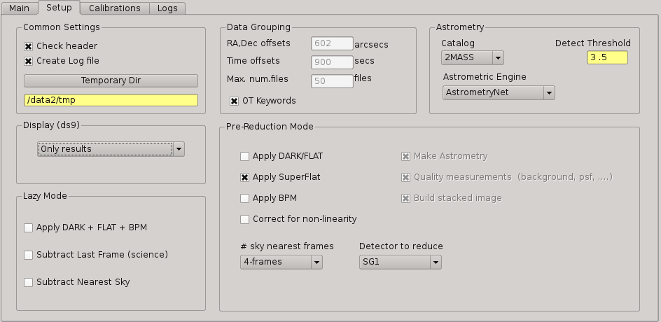

Common Settings
^^^^^^^^^^^^^^^
In this group you can set the next parameters:

#. Check header

#. Create log file

#. Temporary directory

Data grouping
^^^^^^^^^^^^^
It contains some parameters used for the data grouping when any OT keywords are present; 
in that case, PQL will try to group the files follwing the `near` in sky and time criterion:

#. RA,Dec offsets:

#. Time offsets:

#. Max. number of files:

If OT keywords are present, then check box 'OT' should be ckecked (default mode).

Astrometry
^^^^^^^^^^
In this group you can set some parameters related with the astrometric calibration done
during the processing:

#. Catalog: reference catalog used for the calibration (2MASS , USNO-B1, GSC 2.2, SDSS-R5)

#. Astrometric Engine: which tool you want to use to the astrometric calibration (SCAMP or Astrometry.net).

#. Detect threshold: the SExtractor_ threshold to be used to detect sources

.. _display:

Display
^^^^^^^

Here you can select which files are displayed automatically in the DS9. You have next options:

- Only results (default): only FITS files created in the output directory as result of some processing
- Only new files: only new FITS files detected in the input directory
- All files: both new files detected in the input directory and the results in the output directry.
- None: no files will be displayed

Lazy mode
^^^^^^^^^
Under this box, the user can select the operations to be executed 
when the :ref:`Lazy Mode <quicklook_mode>` is activated in PQL. Currectly, 
the available and exclusive operations are:

- Apply Dark + Flat + BPM
- Subtract Last Frame (science)
- Subtract Nearest Sky

Pre-reduction
^^^^^^^^^^^^^
Under this box, the user can select the operations to be executed 
when the :ref:`Pre-reduction Mode <quicklook_mode>` is activated in PQL. Currectly, 
the available and exclusive operations are:

- Apply Dark and FlatField
- Apply SuperFlat (default)
- Apply BPM (Bad Pixel Map)
- Correct for non-linearity
- Select the number of frames to computer the sky bacground: 1-5 (default 4)
- Detector to reduce: SG1 (default), SG2, SG3, SG4, SG123, All

Calibrations panel
------------------

**TBD**

Log panel
---------
It is an extension or duplicate of the :ref:`Even Log window <event_log_window>` of the main panel, 
but with a wider area for messages.

.. _event_log_window:

Event log window
================
The event log window shows important events and results generated by PQL. For example,
the filename of the new files generated are shown, or the error produced while the processing
of some sequence. This window is used only as output, and you cannot type any command on it.

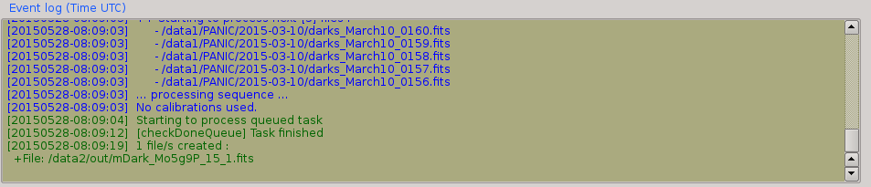
   
   
Pop-up menu
===========

It is a context pop-up menu that appears when the user select a file (or
a set of them) in the :ref:`Data List View <data_list_view>` and click the right mouse button.
Next figure shows the options of that pop-up menu:

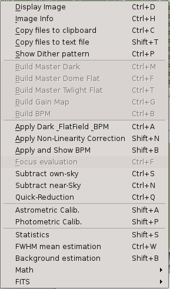

Some actions in the menu could be disabled and greyed out if they are not
availabe or applicable to the selected files.
   
Display image
-------------
It displays the currect selected image in the SAOImage ds9_ display; 
it will launch the ds9 application if it is not opened yet.

Image info
----------
It is a quick way to see some basic information of the selected image. The information
is mainly concerning the FITS structure and exposition times used. The information will
be shown in the :ref:`Event Log Window <event_log_window>` as follow:

::

  ---------------
  SEF Filename : /data1/PANIC/2015-05-19_SS_zenith_Ks_1_3/SS_Ks_SG1_4_0024.fits
  Image Shape : (32, 32)
  Filter : Ks 
  ITIME : 0.045000 
  NCOADDS : 1 
  EXPTIME : 0.045000 
  TYPE : FOCUS 
  OT keywords : True 
  ---------------

Of course, if you need any other information of the file, you can find it using
the 'ds9->File->Display Header...' option.

Copy files to clipboard
-----------------------
It copies the current selected files to the clipboard. This way you could paste the 
full pathnames to any other file. It is quite useful when using the PAPI commands
on the command line to run some operation that is not available on PQL.
  
Copy files to text file
-----------------------
If copies the current selected files into the specified text file. It is quite useful 
when using the PAPI command line to run some operation that is not available on PQL.

Show Dither pattern
-------------------
It brings up a plot of the full FOV and with the dither offsets obtained from the RA,Dec coordinates 
found in the FITS header. You have to select a set of images in the *Data List View* and
then right-button and *Show Dither pattern*.

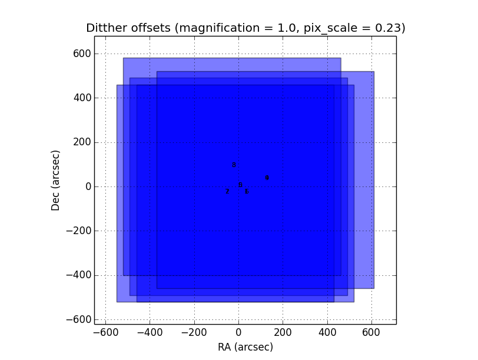
   

.. _calibrations:

Calibrations
------------
Next options allow you to build the master calibration files from a given set of selected files.

Build Master Dark
^^^^^^^^^^^^^^^^^
This command is used to produce a master DARK file combining the set of files currectly selected 
in the *Data List View*. It checks that all the selected files are compliant, ie., 
have the same EXPTIME, NCOADD, ITIME, READMODE and shape. You only have to give the name of 
the master dark file to be created.

The master dark is computed using an average combine with a minmax rejection algorithm.
   

Build Master Dome Flat
^^^^^^^^^^^^^^^^^^^^^^
This command is used to produce a Master DOME FLAT file combining  the set of files currectly selected 
in the :ref:`Data List View <data_list_view>`. It checks that all the selected files are compliant, ie., 
have the same FILTER, NCOADD, READMODE and shape. You have to select at least one DOME_FLAT_LAMP_OFF 
and one DOME_FLAT_LAMP_ON image, and then provide the name for the master dome flat to create.

The procedure to create the master dome flat is as follow: 

    #. Check the EXPTIME , TYPE(dome) and FILTER of each Flat frame
    #. Separate lamp ON/OFF dome flats
    #. Make the median combine + sigmaclip of Flat LAMP-OFF frames 
    #. Make the median combine + sigmaclip of Flat LAMP-ON frames
    #. Subtract lampON-lampOFF (implicit dark subtraction)
    #. (optionally) Normalize the flat-field with median (robust estimator)
            
    Note that we do **not** need to subtract any MASTER_DARK; it is not required for 
    DOME FLATS (it is done implicitly because both ON/OFF flats are taken 
    with the same Exposition Time).

Build Master Twlight (sky) Flat
^^^^^^^^^^^^^^^^^^^^^^^^^^^^^^^
This command is used to produce a Master SKY FLAT file from a set of files currectly selected 
in the :ref:`Data List View <data_list_view>`. It checks that all the selected files are compliant, ie., 
have the same FILTER, NCOADD, READMODE and shape. You have to select at least three SKY_FLAT
images (dusk or dawn). The procedure will look for the required master dark frames to subtract 
in the current output directory and in the external calibration directory. If some of the master dark
are not found, then the procedure will fail.

The procedure to create the master sky flat is as follow:

    #. Check the  TYPE (sky flat) and FILTER of each Flat frame
       If any frame on list missmatch the FILTER, then the master 
       twflat will skip this frame and continue with then next ones.
       EXPTIME do not need be the same, so EXPTIME scaling with 'mode' 
       will be done. 
    
    #. Check either over or under exposed frames ( [10000 < mean_level < 40000] ADUs )
        
    #. We subtract a proper MASTER_DARK, it is required for TWILIGHT FLATS 
       because they might have diff EXPTIMEs.
        
    #. Make the combine (median + sigclip rejection) the dark subtracted Flat 
       frames scaling by 'mode'.
        
    #. Normalize the sky-flat wrt SG1 detector, dividing by its mean value.
    

Build GainMap
^^^^^^^^^^^^^
This command is used to produce a Master GainMap file from a set of files currectly selected 
in the :ref:`Data List View <data_list_view>`. It checks that all the selected files are compliant, ie., 
have the same FILTER, NCOADD, READMODE and shape. You have to select at least three
flat frames (dome, dusk or dawn). For sky flats, the procedure will look for the required master dark 
frames to subtract in the current output directory and in the external calibration directory. 
If some of the master dark are not found, then the procedure will fail. Dome flat do not need
dark subtraction.

The procedure to create the master sky flat is as follow:

    #. Check the  TYPE (sky flat) and FILTER of each Flat frame
       If any frame on list missmatch the FILTER, then the master 
       twflat will skip this frame and continue with then next ones.
       EXPTIME do not need be the same, so EXPTIME scaling with 'mode' 
       will be done. 
       
    #. Create the proper master dome/sky flat.
    
    #. Once the master dome flat is created, the procedure will 
    compute the gainmap as follow:
    

Build BPM
^^^^^^^^^
TBC

.. _applyDark_FF_BPM:

Apply Dark & FlatField & BPM
^^^^^^^^^^^^^^^^^^^^^^^^^^^^

This option subtracts a master dark file, then divides by a flat field and 
finally mask the bad pixels on the current selected files. The master dark 
and master flatfield  files can be searched for automatically into the output 
and external calibration directories or can be selected manually by the user. 

If some of them (dark or flat) are not found or selected (pressing Cancel in 
the file dialog), then it will not be used or applied.

In the case of the bad pixel mask (BPM), it cannot be selected, but specified 
in the PAPI config file. However, the user will be asked for about which action 
to do with the bad pixel mask, whether set bad pixels as NaNs, fix bad pixels 
with an interpolation algorithm or do nothing with BPM.

.. _apply_NLC:

Apply Non-Linearity Correction
^^^^^^^^^^^^^^^^^^^^^^^^^^^^^^

It applies the Non-Linearity correction to the selected file (or set of files) in the
:ref:`Data List View <data_list_view>` and show the result in ds9; it also set bad pixels
to NaN, and will be displayed as green pixels (or the default color configured in 
ds9->Edit->Preferences->General->Color) on the display.

The corrected image is saved in the output directory with a `_LC` suffix.

The master Non-Linearity correction file used for the correction is defined in 
the configuration file :ref:`_configuration_file`.

Apply and show BPM
^^^^^^^^^^^^^^^^^^

This command can be used to apply the BPM to the selected file in :ref:`Data List View <data_list_view>`
the and show the results (NaNs) as green pixels (or the default color configured in 
ds9->Edit->Preferences->General->Color) on the display.

The bad pixel masked image is saved in the output directory with a `_BPM` suffix.

The master Bad Pixel Mask file used is defined in the configuration file :ref:`_configuration_file`.

.. _focus_evaluation:

Focus evaluation
----------------
    
The **Focus evaluation** procedure is based in the IRAF starfocus_ routine. It only
differs on the final plot that is obtained from non-saturated stars, and the
best focus is computed computing the curve fit of these points. The PSF size is measured
with the the FWHM of the best fit Moffat profile (MFWHM).

Once you have obtained a focus series using the Observation Tool, the procedure to evaluate and  
get the best focus value for that serie is as follow:

.. warning::

   The input images of the focus series should be saved as SEF (Single Extension FITS), 
   because IRAF starfocus_ does not works with MEF files. However, if your focus series was saved as SEF,
   the routine will previously convert  to SEF, and then you should not have to do
   any other conversion.
    

1. Select the files of the focus series from the :ref:`Data List View <data_list_view>`

2. Right-click and select **Focus evaluation**.
   An IRAF console  and ds9 windows will bring up, and the first file of the 
   focus series will be displayed on ds9.
   
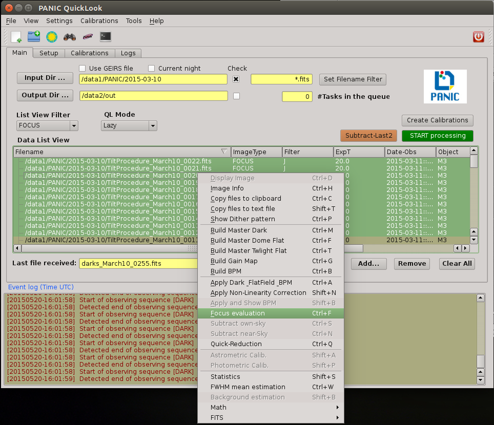
   
3. Focus the mouse over the stars you think are nice for the evaluation and 
   type **m** or **g** (give the profile of the selected star).

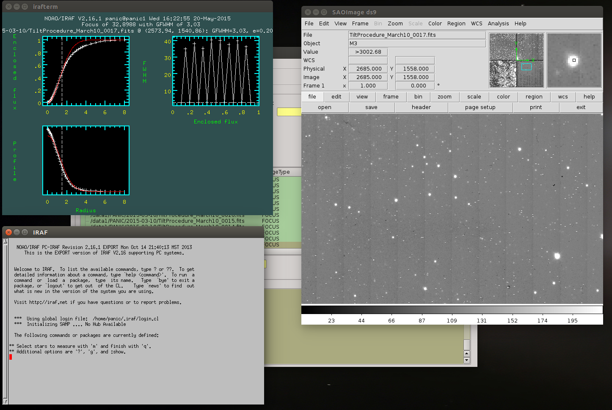
   
4. When you have finished of selecting all the stars you want for the focus evaluation,
   type **q**.

5. Then, an IRAF interactive graphics with the first fit will appear, and the best focus obtained.
   On that graphics, you should remove the images/stars/focus/points thay you consider are not
   good for the focus evaluation (outliers); for this, type **x** and then i/s/f/p.
   Type **u** to undo the removing of the outliers.
   If you need more info about this commands see starfocus_
|
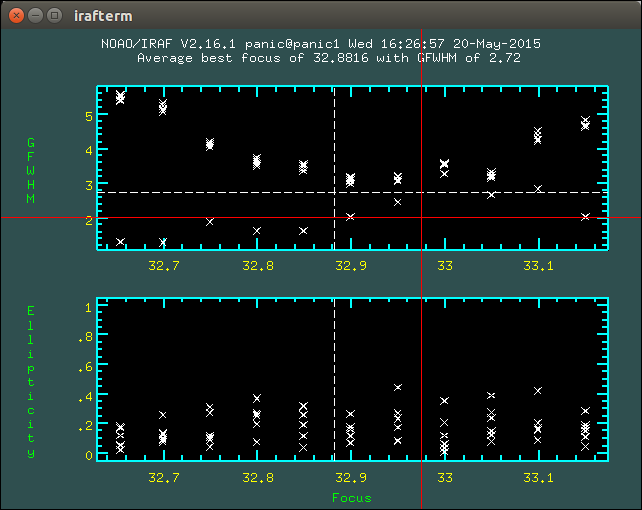

|   

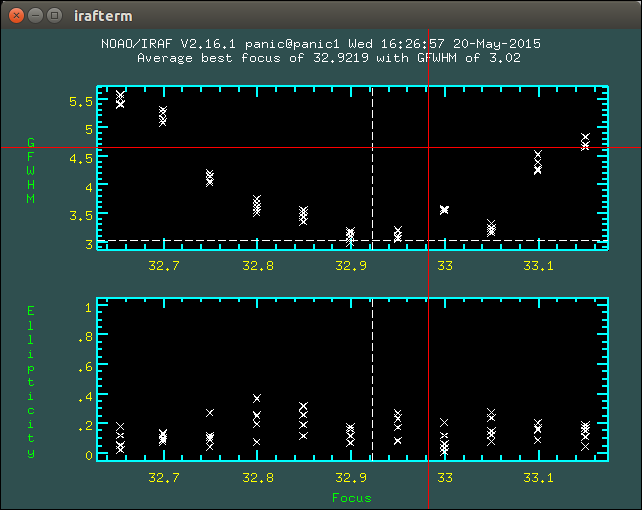
   
5. Once you have removed the outliers, type **q** (with the focus on the plot window)
   and you will get the final plot with the fit of the values, and the estimation 
   for the best focus of the telescope.
   
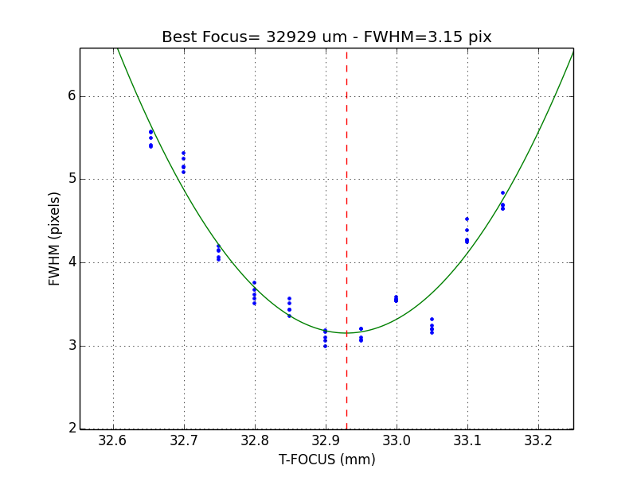

6. Finally, the best focus obtained will be sent to the OT (which will ask you 
   for confirmation) for setting the new telescope focus.

Subtract own-sky
----------------
It subtracts the background to the current selected image; the background computation
is done using the own image. For this,  `-BACKGROUND` option of SExtractor_ is used.

Subtract near-sky
-----------------
It subtracts the background to the currect selected image using the closest (in time) 
images to the currectly selected. Once the close images have been found, PQL asks
the user to confirm about them to proceede to the background computation and subtraction.

.. _quick_reduction:

Quick reduction
---------------
It allows you to perform a quick reduction of the selected files (at least 5 files are required)
on the :ref:`Data List View <data_list_view>`.

If you only select one file, then the PQL will look for the nearest (in time) files and
ask you to confirm about them and the desired name for the final coadd.

For the quick reducion, the pipeline will use the preferences set up on 'Setup' tab.

Once the quick reducion is done, the filename will be written in the :ref:`Event Log Window <event_log_window>`,
and if selected, it will be display on DS9 display.

Astrometric calibration
-----------------------
.. note::

    Although the input FITS file does not need to be **calibrared**, it is recommended.
    
The astrometric calibration is built on top of Astrometry.net_ tool. The command asks you
about which detector to use of the calibration (SG1/Q1, SG2/Q2, SG3/Q3 or SG4/Q4).

The new astrometrically calibrated file will be created in the output directory speficied earlier,
and will have the same name as the original input file but ending with the `.ast.fits` suffix.

Once the astrometric calibration is done, you could look into the header keyword 
ROTANGLE, which gives you the rotation angle of the image. It can be useful 
to check whether the instrument rotator is set properly at the telescope.

Photometric calibration
-----------------------
.. note::

   Your **data is assumed to be calibrated**. Dark subtraction, flat-fielding correction and any 
   other necessary steps should have been performed before any data is fed to the photometric 
   calibration.
   
We need to first distinguish between absolute and relative photometric calibration.  
Absolute photometric calibration would be required to determine the system throughput 
and/or the true magnitude of our stars.  Relative photometry is a simpler task that 
would allow us to measure the uniformity and linearity of response across the detector.  
This section refers to absolute photometry.
   
The photometric calibration involves taking sufficiently long integrations with PANIC
to get good a good SNR.  The night must be photometric and the integration time and zenith 
angle need to be recorded.  To reduce the dependence on zenith angle it would be best to 
take images within 30º of zenith.  The photometric calibration can be performed  
using the saved images.
   
The photometric calibration will be useful for validating our throughput calculations.
Using the photometric calibration to determine the true magnitudes of stars is more 
challenging. 

Statistics
----------
It gives some statistics (mean, mode, stddev, min, max) values of the currently selected image/s. 
If the image/s is/are MEF, then the command shows the stats of each extension [1-4], 
as shown in next example:

::
    
    FILE                                                               MEAN     MODE       STDDEV   MIN     MAX
    /data1/PANIC/2015-03-10/Standard_Star_FS27_March10_0060.fits[1]  6030.568  2377.875  8704.104  -1622.  49761.
    /data1/PANIC/2015-03-10/Standard_Star_FS27_March10_0060.fits[2]  3069.276  3096.073  866.066  -5102.  54369.
    /data1/PANIC/2015-03-10/Standard_Star_FS27_March10_0060.fits[3]  3852.473  3223.324  4300.289  -2509.  53549.
    /data1/PANIC/2015-03-10/Standard_Star_FS27_March10_0060.fits[4]  3219.446  3060.269  2335.363  -4098.  53604.
    /data1/PANIC/2015-03-10/Standard_Star_FS27_March10_0059.fits[1]  6059.874  2386.128  8698.008  -1629.  50722.
    /data1/PANIC/2015-03-10/Standard_Star_FS27_March10_0059.fits[2]  3106.257  3151.27  849.268  -5109.  54257.
    /data1/PANIC/2015-03-10/Standard_Star_FS27_March10_0059.fits[3]  3862.996  3222.919  4270.374  -2515.  53309.
    /data1/PANIC/2015-03-10/Standard_Star_FS27_March10_0059.fits[4]  3258.566  3099.714  2331.496  -4100.  52753.
    

FWHM mean estimation
--------------------
This command computes the FWHM of the selected image, using the FWHM_IMAGE value returned by
SExtractor_. For the computation, only stars which fulfill the next requirements are selected:

#. not near the edge of the detector

#. elliticiy < ellipmax (default = 0.3)

#. area > minare (default 32 pix)

#. snr > snr_min (default 5)

#. sextractor flag = 0 (the most restrictive!)

#. fwhm in range [0.1 - 20] (to avoid outliers)

For MEF files, the application will ask you which detector you want to use for
the FWHM estimation.

.. note::

    It is worth mentioning that SExtractor_ does a background subtraction when looking
    for objects and that the FWHM value is rather imperfect and overstimated compared 
    with IRAF (imexam) values.

    E. Bertin:
    "There are currently 2 ways to measure the FWHM of a source in SExtractor. Both are rather imperfect:
     - FWHM_IMAGE derives the FWHM from the isophotal area of the object at half maximum.
     - FLUX_RADIUS estimates the radius of the circle centered on the barycenter that 
       encloses about half of the total flux. For a Gaussian profile, this is equal to 1/2 FWHM. 
       But with most images on astronomical images it will be slightly higher.
    
    A profile-fitting option will be available in the next version of SExtractor. I am 
    currently working on it."
    
Background estimation
---------------------
This command shows the background image of the currently selected image, using the
SExtractor_ feature 'CHECKIMAGE_TYPE=BACKGROUND'.

Math operations
---------------

This option allows the next basic operations with the FITS files selected on the 
:ref:`Data List View <data_list_view>`:

#. Sum images: it allows the selection of two or more images; single arithmetic sum
   will be done.

#. Subtract images: only two images can be selected.

#. Divide images: only two images can be selected.

#. Combine images (median + sigmaclip): it allows the selection of two or more images.

If FITS files are cubes (with the same dimension), then the math operation will be 
done plane by plane. 

FITS operations
---------------

This option allows the next conversion operations with the FITS files selected on the 
:ref:`Data List View <data_list_view>`:

#. **MEF2Single**: converts a MEF file to SEF file

#. **Single2MEF**: converts a SEF file to MEF file

#. **Split MEF**: extracts the extension (one per each detector) of the MEF file to individual files

#. **Split Single**: extracts the extension (one per each detector) of the SEF file to individual files

#. **Collapse Cube**: sums arithmeticly the planes of the given cube single plane 2D-image

#. **Create DataSeq**: modifies headers of the set of selected FITS files to create a new 
   *Data Sequece* compliant with PAPI as they would be observed with the OT.
   This command can be usefil to fix or re-order broken sequences (observation was
   interrupted) or to remove or add files to a observed sequence.
   You will be asked for the type of sequence (DARK, DOME_FLAT, SKY_FLAT, FOCUS 
   or SCIENCE) you want to create.

.. _howto:

How do I ...?
=============

How do I report a issue ?
-------------------------
Please submit issues with the `issue tracker <https://github.com/ppmim/PAPI/issues>`_ on github.

How to determine the telescope focus ?
--------------------------------------
To determine the telescope focus, you should run a OT focus serie around the 
guest value and then run the :ref:`Focus Evaluation <focus_evaluation>`.

How to inspect the profile of the stars in an image ?
-----------------------------------------------------
You should follow the next steps:

1. select in the *Data List View* the image to inspect.
2. double-click to display the image into ds9 and zoom to the area you wish to inspect
3. go to the tool bar (or Tool menu) and open an IRAF console
4. type in the iraf console 'imexam'
5. focus the mouse cursor on the ds9_ display and type the *imexam* comand you wish
   for the inspection. For example, type ***r*** to show the *radial profile* of 
   the selected star
6. once you have finished the inspection, type q to exit from *imexam*

How do I quick-reduce an observed sequence ?
--------------------------------------------
There are two options:

- if you know the files that compose the sequence,
  you can select them and then right-click and run the `Quick-Reduction` command.

- go to the :ref:`List View Filter <list_view_filter>` and select `GROUP`; then
  look for the sequence you are looking for in the :ref:`Data List View <data_list_view>`, 
  right-click and select `Reduce Sequece` command.

For the quick reducion, the pipeline will use the preferences established 
on 'Setup' tab.

How do I make mosaics with PQL? 
-------------------------------
By default, PQL proccess or pre-reduce only the SG1 detector (Q1), 
and then no mosaic is built. However, you can go to the `Setup Tab` 
and modify in the `Detector to reduce` combo box the detector/s to reduce; 
in case of selecting `All` or `SG123` (all less SG4), the corresponding 
mosaic will be generated.

Currently, PAPI aligns and coadds (using SWARP) the images as they are 
located on the sky to build the mosaic. 

How do I make use of parallelisation ?
--------------------------------------
Just be sure the number of *parallel* parameter is set to *True* on 
the $PAPI_CONFIG file.
When `parallel=True`, the pipeline will reduce each detector in parallel 
using all the cores available in your computer.

.. index:: quicklook, off-line, on-line, configuration

.. _FITS: http://fits.gsfc.nasa.gov
.. _IRAF: http://iraf.noao.edu/
.. _starfocus: http://stsdas.stsci.edu/cgi-bin/gethelp.cgi?starfocus
.. _ds9: http://ds9.si.edu/site/Home.html
.. _Aladin: http://aladin.u-strasbg.fr
.. _LEMON: https://lemon.readthedocs.org/
.. _astrometry.net: http://astrometry.net
.. _GEIRS: http://www2.mpia-hd.mpg.de/~mathar/public/PANIC-SW-DCS-01.pdf
.. _SExtractor: http://www.astromatic.net/software/sextractor
