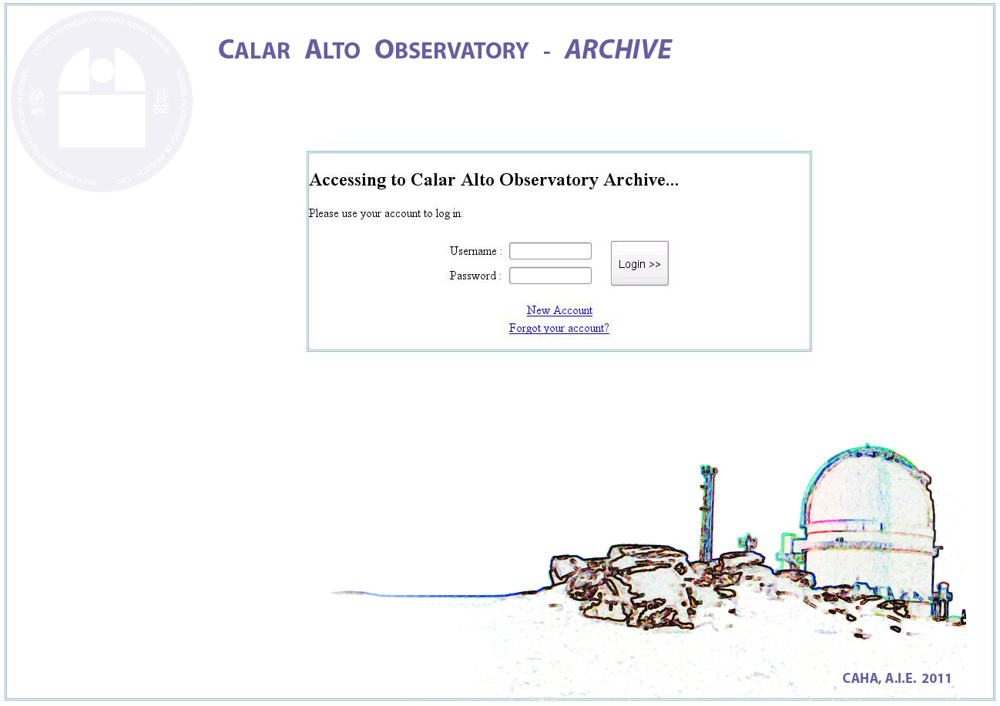

Running PAPI
============

.. index:: quickstart, running

Quickstart
**********

Running PAPI can be as simple as executing the following command in a terminal::
	
	$ papi.py -s raw_data -d result 

Where ``raw_data`` is the directory of the raw dataset (uncalibrated) having 
both science or calibration files, and ``result`` is the path to the directory 
where the calibrated data produced by the pìpeline will be saved.

Example::

   $ papi.py -s /my/raw_data/directory -d /my/result/directory

.. index:: uncalibrated, data

Optional Commands
*****************

For most image sets PAPI can be run in the default configuration with no 
additional interaction required. If the default settings are insufficient for 
processing a particular data set, there are a number of run-time options which 
may be applied to help improve the reductions.

The next command will show some of the available options::

   $ papi.py --help

Then, the listing of the PAPI command line options::

    Usage: papi.py [OPTION]... DIRECTORY...
    
    This is the main module of the PANIC data reduction system (PAPI)
    
    Options:
      --version             show program's version number and exit
      -h, --help            show this help message and exit
      -c CONFIG_FILE, --config=CONFIG_FILE
                            Config file for the PANIC Pipeline application.
                            If not specified, './config_files/papi_suse11.cfg' is
                            used.
      -C, --Check           Check if versions of PAPI modules are right.
      -s SOURCE, --source=SOURCE
                            Source file list of data frames. It can be a file
                            or directory name.
      -o OUTPUT_FILE, --output_file=OUTPUT_FILE
                            Final reduced output image
      -t TEMP_DIR, --temp_dir=TEMP_DIR
                            Directory for temporal files
      -d OUTPUT_DIR, --out_dir=OUTPUT_DIR
                            Output dir for product files
      -r ROWS, --rows=ROWS  Use *only* files of the source file-list in the range
                            of rows specified (0 to N, both included)
      -R, --recursive       Does recursive search for files in source directory
      -l, --list            Generate a list with all the source files read from
                            the source only sorted by MJD
      -M REDUCTION_MODE, --red_mode=REDUCTION_MODE
                            Mode of data reduction to do (lemon|quick|science)
      -m OBS_MODE, --obs_mode=OBS_MODE
                            Observing mode (dither|ext_dither|other)
      -p, --print           Print detected sequences in the Data Set
      -S SEQ_TO_REDUCE, --seq_to_reduce=SEQ_TO_REDUCE
                            Sequence number to reduce. By default,
                            all sequences found will be reduced.
      -D MASTER_DARK, --master_dark=MASTER_DARK
                            master dark to subtract
      -F MASTER_FLAT, --master_flat=MASTER_FLAT
                            master flat to divide by
      -b BPM_FILE, --bpm_file=BPM_FILE
                            bad pixel mask file
      -g GROUP_BY, --group_by=GROUP_BY
                            kind of data grouping (based on) to do with the
                            dataset files (ot |filter)
      -k, --check_data      if true, check data properties matching (type, expt,
                            filter, ncoadd, mjd)
      -v, --verbose         Verbose mode [default]

  
	
Configuration files
*******************
PAPI has a set of configuration files required to run properly. They are the next
ones:

   * papi.cfg:  main configuration file

      In addition to the command line options, PAPI has a configuration file in 
      which the user can set both the command line options  and a wider set of 
      additional ones. 
      This config file can be specified with the ``-c`` option, but by default it 
      is looked for it in the ``config_files`` directory defined by PAPI_CONFIG 
      environment variable.

   * scamp.cfg: SCAMP configuration file
   * swarp.conf: SWARP configuration file
   * sextractor.sex : SExtractor configuration file
   * sextractor.conf: 
   * sextractor.cong:
   * sextractor.nnw:
   * sextractor.param:
   
    
.. index:: run, command line, config

Examples
********
Show grouped files in a row directory
-------------------------------------
Command::

    $papi.py -s /my/raw_data/directory -p

Show grouped files per filter and coordinates in a row directory 
----------------------------------------------------------------
Command::

    $papi.py -s /my/raw_data/directory -g filter -p 

Getting PAPI Data
*****************

The PAPI pipeline requires the full set of uncalibrated data products 
and best reference files for each observation in the input image set. These files 
can be readily obtained through the CAHA_ archive. When
requesting data from CAHA you need to specify:
   
   * Instrument : **PANIC**
   * Science Files Requested: **Uncalibrated - Raw** 
   * Reference Files: **Advanced Data Products**

.. _CAHA: http://caha.sdc.cab.inta-csic.es/calto/index.jsp

.. index:: options

Troubleshooting
***************

As we stated previously, PAPI was developed primarily for reducing NIR imaging
data of any kind of sources (galactic, extragalactic, coarse or crowed fields, 
and extended objects). Here are some tips for reducing each types of data:

* Coarse fields:
* Crowded fields:
* Extended objects:

*Add tips here*