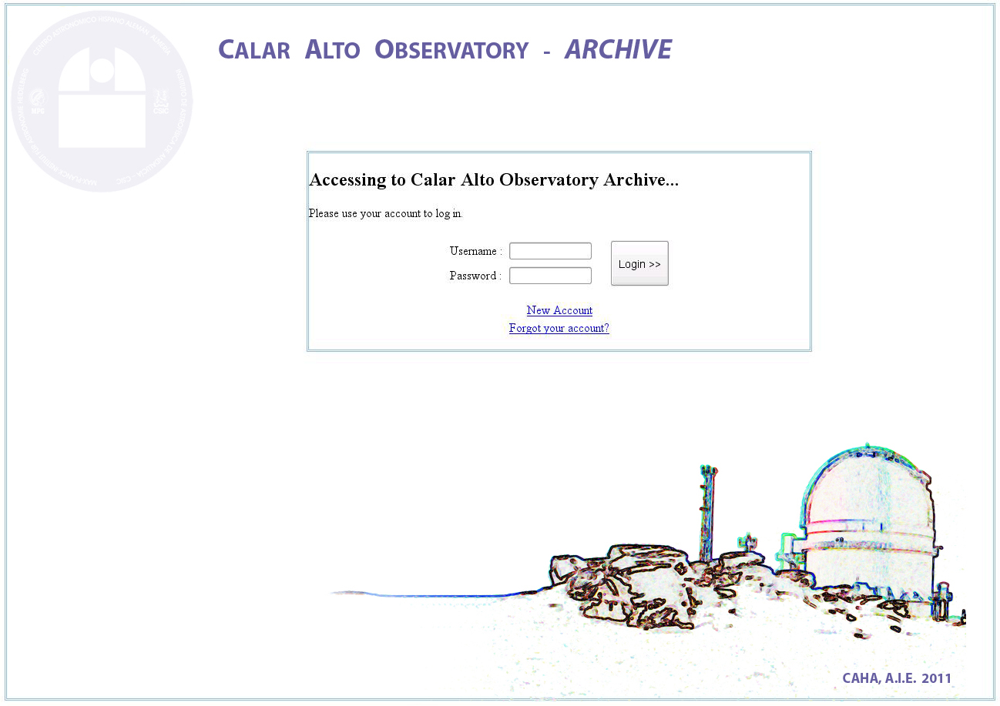

.. _papi:

PAPI
****

.. index:: quickstart, running

Purpose
=======

PANIC pipeline (hereafter PAPI) performs the automatic data processing both for
quick-look and for science quality of the data produced by PANIC. The automated 
processing steps include basic calibration (removeing instrumental signature, dark 
and flat-fielding), cosmic-ray removal, treatment for electronic ghosts (cross-talk), 
sky subtraction, non-linear count-rate correction, robust alignment and registration
removing the field distortion.

This chapter gives an introduction in how to get started with PAPI, showing the 
steps that would normally be necessary to reduce a data set from PANIC. In particular, 
this example assumes that we have a series of FITS images from an observation run.

Quickstart
==========

Running PAPI can be as simple as executing the following command in a terminal::
	
	$ papi.py -s raw_data -d result 

Where ``raw_data`` is the directory of the raw dataset (uncalibrated) having 
both science or calibration files, and ``result`` is the path to the directory 
where the calibrated data produced by the pìpeline will be saved.

Example::

   $ papi.py -s /my/raw_data/directory -d /my/result/directory

.. index:: uncalibrated, data

Optional Arguments
------------------

For most image sets PAPI can be run in the default configuration with no 
additional interaction required. If the default settings are insufficient for 
processing a particular data set, there are a number of run-time options which 
may be applied to help improve the reductions.

The next command will show some of the available options::

   $ papi.py --help

Then, the listing of the PAPI command line options:

::

    Usage: papi.py [OPTION]... DIRECTORY...
    
    This is PAPI, the PANIC PIpeline data reduction system - IAA-CSIC - Version 1.2.20150508064845

    Options:
    --version             show program's version number and exit
    -h, --help            show this help message and exit
    -c CONFIG_FILE, --config=CONFIG_FILE
                            Config file for the PANIC Pipeline application.If not
                            specified, './config_files/papi.cfg' is used.
    -s SOURCE, --source=SOURCE
                            Source file list of data frames. It can be a fileor
                            directory name.
    -d OUTPUT_DIR, --out_dir=OUTPUT_DIR
                            Output dir for product files
    -o OUTPUT_FILE, --output_file=OUTPUT_FILE
                            Final reduced output image
    -t TEMP_DIR, --temp_dir=TEMP_DIR
                            Directory for temporal files
    -r ROWS, --rows=ROWS  Use _only_ files of the source file-list in the
                            rangeof rows specified (0 to N, both included)
    -R, --recursive       Does recursive search for files in source directory
    -l, --list            Generate a list with all the source files read fromthe
                            source and sorted by MJD
    -M REDUCTION_MODE, --red_mode=REDUCTION_MODE
                            Mode of data reduction to do (quick|science|lab|lemon
                            |quick-lemon).
    -m OBS_MODE, --obs_mode=OBS_MODE
                            Observing mode (dither|ext_dither|other)
    -S SEQ_TO_REDUCE, --seq_to_reduce=SEQ_TO_REDUCE
                            Sequence number to reduce. By default, all sequences
                            found will be reduced.
    -W DETECTOR, --window_detector=DETECTOR
                            Specify which detector to process:Q1(SG1), Q2(SG2),
                            Q3(SG3), Q4(SG4), Q123(all except SG4), all [default:
                            all]
    -p, --print           Print all detected sequences in the Data Set
    -T SEQ_TYPE, --sequences_type=SEQ_TYPE
                            Specify the type of sequences to show: DARK,
                            FLAT(all), DOME_FLAT, SKY_FLAT, FOCUS, SCIENCE, CAL,
                            all [default: all]
    -b, --build_calibrations
                            Build all the master calibrations files
    -C EXT_CALIBRATION_DB, --ext_calibration_db=EXT_CALIBRATION_DB
                            External calibration directory (library of Dark & Flat
                            calibrations)
    -D MASTER_DARK, --master_dark=MASTER_DARK
                            Master dark to subtract
    -F MASTER_FLAT, --master_flat=MASTER_FLAT
                            Master flat to divide by
    -B BPM_FILE, --bpm_file=BPM_FILE
                            Bad pixel mask file
    -g GROUP_BY, --group_by=GROUP_BY
                            kind of data grouping (based on) to do with thedataset
                            files (ot |filter)
    -k, --check_data      if true, check data properties matching (type, expt,
                            filter, ncoadd, mjd)
    -e, --Check           Check if versions of PAPI modules are right.

  

Input FITS data files
---------------------

GEIRS is capable of saving the frames in different modes (integrated, FITS-cubes,
MEF, etc ). Next ones are available in the OT when the OP (Observing Program) 
is defined:

 - Multi-Extension FITS (MEF) - Integrated
 - Multi-Extension FITS (MEF) - Cube
 - Integrated All (SEF - Integrated)
 - FITS Cube (SEF - Cube)
 - Individual (SEF - Individual)
 

However, PAPI does not accept any kind of FITS data files available in GEIRS, only
the configured in the OT, except `Individual`. As result, PAPI accepts 
the next type of FITS files (in order of preference):

 - Integrated Multi-Extension-FITS (MEF): a unique FITS file with four extensions (MEF),
   where each extension corresponds to one of the 4 images produced by the single
   detector chips. 
   If the number of coadd (NCOADDS) is > 0, then they will be integrated (arithmetic sum) 
   in a single image. This is the default and more common saving mode used; in fact, it
   is the **default** and more wished saving mode.   
   This mode will also be used when the software or hardware sub-windowing is set and 
   the integrated option is selected. Then, there will be an extension for each sub-window.
 
 - Non-integrated Multi-Extension-FITS (MEF): a unique FITS file with four extensions (MEF), 
   one per each detector (or window), having each extension N planes, where N is the number 
   of coadds (NCOADDS), ie. a cube of N planes.  
   This mode will be also used when the software or hardware subwindowing is set up and 
   the no-integrated option is selected.
 
 - Single integrated FITS file: the four detectors are saved in single file and in a 
   single extension FITS image (SEF). If the number of coadds (NCOADDS) is > 0, then 
   they are integrated (arithmetic sum) in a single frame.

 - Single non-integrated FITS-cube: the four detectors are saved in a single extension 
   FITS (SEF) file, and each individual exposition in a plane/layer of a cube. It means N 
   planes, where N is the number of coadds or expositions.
 
 
 .. Note:: Currently PAPI is **not working** with non-integrated *individual* files of an 
    exposition. In case you are interested in no-integrated files and wish to reduce 
    the data with PAPI, you should use SEF of MEF non-integrated FITS-cube mode.

Show grouped files in a raw directory
-------------------------------------
For the grouping the application uses the :ref:`keywords <fits_headers>` written 
by the OT during the observation.

Command::

    $papi.py -s /my/raw_data/directory -p
    
Example::

    $papi.py -s /data2/2015-03-10/ -p
    
    [PAPI]: 2015-05-28 09:18:01,484 DEBUG    reductionset:1150: Found 16 groups of files
    [PAPI]: 2015-05-28 09:18:01,484 DEBUG    reductionset:1157: =========================================================
    [PAPI]: 2015-05-28 09:18:01,484 DEBUG    reductionset:1158: =========== GROUPED SEQUENCES (by ot) ==============
    [PAPI]: 2015-05-28 09:18:01,484 DEBUG    reductionset:1159: =========================================================
    [PAPI]: 2015-05-28 09:18:01,484 DEBUG    reductionset:1167: SEQUENCE #[0]  - TYPE= DOME_FLAT   FILTER= H2  TEXP= 2.739931  #files = 2 
    [PAPI]: 2015-05-28 09:18:01,485 DEBUG    reductionset:1168: -------------------------------------------------------------------
    [PAPI]: 2015-05-28 09:18:01,485 DEBUG    reductionset:1170: /data2/2015-03-10/domeflats_0042.fits type = DOME_FLAT_LAMP_ON
    [PAPI]: 2015-05-28 09:18:01,485 DEBUG    reductionset:1170: /data2/2015-03-10/domeflats_0043.fits type = DOME_FLAT_LAMP_OFF
    [PAPI]: 2015-05-28 09:18:01,485 DEBUG    reductionset:1167: SEQUENCE #[1]  - TYPE= SKY_FLAT   FILTER= H2  TEXP= 6.398718  #files = 5 
    [PAPI]: 2015-05-28 09:18:01,485 DEBUG    reductionset:1168: -------------------------------------------------------------------
    [PAPI]: 2015-05-28 09:18:01,485 DEBUG    reductionset:1170: /data2/2015-03-10/skyflats_dusk_0001_seq.fits type = SKY_FLAT
    [PAPI]: 2015-05-28 09:18:01,485 DEBUG    reductionset:1170: /data2/2015-03-10/skyflats_dusk_0002_seq.fits type = SKY_FLAT
    [PAPI]: 2015-05-28 09:18:01,485 DEBUG    reductionset:1170: /data2/2015-03-10/skyflats_dusk_0003_seq.fits type = SKY_FLAT
    [PAPI]: 2015-05-28 09:18:01,486 DEBUG    reductionset:1170: /data2/2015-03-10/skyflats_dusk_0004_seq.fits type = SKY_FLAT
    [PAPI]: 2015-05-28 09:18:01,486 DEBUG    reductionset:1170: /data2/2015-03-10/skyflats_dusk_0005_seq.fits type = SKY_FLAT
    [PAPI]: 2015-05-28 09:18:01,486 DEBUG    reductionset:1167: SEQUENCE #[2]  - TYPE= SKY_FLAT   FILTER= KS  TEXP= 2.739931  #files = 17 
    [PAPI]: 2015-05-28 09:18:01,486 DEBUG    reductionset:1168: -------------------------------------------------------------------
    [PAPI]: 2015-05-28 09:18:01,486 DEBUG    reductionset:1170: /data2/2015-03-10/skyflats_dusk_0006_seq.fits type = SKY_FLAT
    [PAPI]: 2015-05-28 09:18:01,486 DEBUG    reductionset:1170: /data2/2015-03-10/skyflats_dusk_0007_seq.fits type = SKY_FLAT
    [PAPI]: 2015-05-28 09:18:01,486 DEBUG    reductionset:1170: /data2/2015-03-10/skyflats_dusk_0008_seq.fits type = SKY_FLAT
    [PAPI]: 2015-05-28 09:18:01,487 DEBUG    reductionset:1170: /data2/2015-03-10/skyflats_dusk_0009_seq.fits type = SKY_FLAT
    [PAPI]: 2015-05-28 09:18:01,487 DEBUG    reductionset:1170: /data2/2015-03-10/skyflats_dusk_0010_seq.fits type = SKY_FLAT
    [PAPI]: 2015-05-28 09:18:01,487 DEBUG    reductionset:1170: /data2/2015-03-10/skyflats_dusk_0011_seq.fits type = SKY_FLAT
    [PAPI]: 2015-05-28 09:18:01,487 DEBUG    reductionset:1170: /data2/2015-03-10/skyflats_dusk_0012_seq.fits type = SKY_FLAT
    [PAPI]: 2015-05-28 09:18:01,487 DEBUG    reductionset:1170: /data2/2015-03-10/skyflats_dusk_0013_seq.fits type = SKY_FLAT
    [PAPI]: 2015-05-28 09:18:01,487 DEBUG    reductionset:1170: /data2/2015-03-10/skyflats_dusk_0014_seq.fits type = SKY_FLAT
    [PAPI]: 2015-05-28 09:18:01,487 DEBUG    reductionset:1170: /data2/2015-03-10/skyflats_dusk_0015_seq.fits type = SKY_FLAT
    [PAPI]: 2015-05-28 09:18:01,487 DEBUG    reductionset:1170: /data2/2015-03-10/skyflats_dusk_0016_seq.fits type = SKY_FLAT
    [PAPI]: 2015-05-28 09:18:01,488 DEBUG    reductionset:1170: /data2/2015-03-10/skyflats_dusk_0017_seq.fits type = SKY_FLAT
    [PAPI]: 2015-05-28 09:18:01,488 DEBUG    reductionset:1170: /data2/2015-03-10/skyflats_dusk_0018_seq.fits type = SKY_FLAT
    [PAPI]: 2015-05-28 09:18:01,488 DEBUG    reductionset:1170: /data2/2015-03-10/skyflats_dusk_0019_seq.fits type = SKY_FLAT
    [PAPI]: 2015-05-28 09:18:01,488 DEBUG    reductionset:1170: /data2/2015-03-10/skyflats_dusk_0020_seq.fits type = SKY_FLAT
    [PAPI]: 2015-05-28 09:18:01,488 DEBUG    reductionset:1170: /data2/2015-03-10/skyflats_dusk_0021_seq.fits type = SKY_FLAT
    [PAPI]: 2015-05-28 09:18:01,488 DEBUG    reductionset:1170: /data2/2015-03-10/skyflats_dusk_0022_seq.fits type = SKY_FLAT
    [PAPI]: 2015-05-28 09:18:01,488 DEBUG    reductionset:1167: SEQUENCE #[3]  - TYPE= SKY_FLAT   FILTER= H  TEXP= 2.739931  #files = 6 
    [PAPI]: 2015-05-28 09:18:01,489 DEBUG    reductionset:1168: -------------------------------------------------------------------
    [PAPI]: 2015-05-28 09:18:01,489 DEBUG    reductionset:1170: /data2/2015-03-10/skyflats_dusk_0023_seq.fits type = SKY_FLAT
    [PAPI]: 2015-05-28 09:18:01,489 DEBUG    reductionset:1170: /data2/2015-03-10/skyflats_dusk_0024_seq.fits type = SKY_FLAT
    [PAPI]: 2015-05-28 09:18:01,489 DEBUG    reductionset:1170: /data2/2015-03-10/skyflats_dusk_0025_seq.fits type = SKY_FLAT
    [PAPI]: 2015-05-28 09:18:01,489 DEBUG    reductionset:1170: /data2/2015-03-10/skyflats_dusk_0026_seq.fits type = SKY_FLAT
    [PAPI]: 2015-05-28 09:18:01,489 DEBUG    reductionset:1170: /data2/2015-03-10/skyflats_dusk_0027_seq.fits type = SKY_FLAT
    [PAPI]: 2015-05-28 09:18:01,489 DEBUG    reductionset:1170: /data2/2015-03-10/skyflats_dusk_0028_seq.fits type = SKY_FLAT
    [PAPI]: 2015-05-28 09:18:01,489 DEBUG    reductionset:1167: SEQUENCE #[4]  - TYPE= SKY_FLAT   FILTER= Z  TEXP= 3.994767  #files = 5 
    [PAPI]: 2015-05-28 09:18:01,490 DEBUG    reductionset:1168: -------------------------------------------------------------------
    [PAPI]: 2015-05-28 09:18:01,490 DEBUG    reductionset:1170: /data2/2015-03-10/skyflats_dusk_0029_seq.fits type = SKY_FLAT
    [PAPI]: 2015-05-28 09:18:01,490 DEBUG    reductionset:1170: /data2/2015-03-10/skyflats_dusk_0030_seq.fits type = SKY_FLAT
    [PAPI]: 2015-05-28 09:18:01,490 DEBUG    reductionset:1170: /data2/2015-03-10/skyflats_dusk_0031_seq.fits type = SKY_FLAT
    [PAPI]: 2015-05-28 09:18:01,490 DEBUG    reductionset:1170: /data2/2015-03-10/skyflats_dusk_0032_seq.fits type = SKY_FLAT
    [PAPI]: 2015-05-28 09:18:01,490 DEBUG    reductionset:1170: /data2/2015-03-10/skyflats_dusk_0033_seq.fits type = SKY_FLAT
    [PAPI]: 2015-05-28 09:18:01,490 DEBUG    reductionset:1167: SEQUENCE #[5]  - TYPE= SKY_FLAT   FILTER= Y  TEXP= 11.023218  #files = 4 
    [PAPI]: 2015-05-28 09:18:01,491 DEBUG    reductionset:1168: -------------------------------------------------------------------
    [PAPI]: 2015-05-28 09:18:01,491 DEBUG    reductionset:1170: /data2/2015-03-10/skyflats_dusk_0034_seq.fits type = SKY_FLAT
    [PAPI]: 2015-05-28 09:18:01,491 DEBUG    reductionset:1170: /data2/2015-03-10/skyflats_dusk_0035_seq.fits type = SKY_FLAT
    [PAPI]: 2015-05-28 09:18:01,491 DEBUG    reductionset:1170: /data2/2015-03-10/skyflats_dusk_0036_seq.fits type = SKY_FLAT
    [PAPI]: 2015-05-28 09:18:01,491 DEBUG    reductionset:1170: /data2/2015-03-10/skyflats_dusk_0037_seq.fits type = SKY_FLAT
    [PAPI]: 2015-05-28 09:18:01,491 DEBUG    reductionset:1167: SEQUENCE #[6]  - TYPE= SKY_FLAT   FILTER= J  TEXP= 51.580027  #files = 3 
    [PAPI]: 2015-05-28 09:18:01,491 DEBUG    reductionset:1168: -------------------------------------------------------------------
    [PAPI]: 2015-05-28 09:18:01,491 DEBUG    reductionset:1170: /data2/2015-03-10/skyflats_dusk_0038_seq.fits type = SKY_FLAT
    [PAPI]: 2015-05-28 09:18:01,492 DEBUG    reductionset:1170: /data2/2015-03-10/skyflats_dusk_0039_seq.fits type = SKY_FLAT
    [PAPI]: 2015-05-28 09:18:01,492 DEBUG    reductionset:1170: /data2/2015-03-10/skyflats_dusk_0040_seq.fits type = SKY_FLAT
    [PAPI]: 2015-05-28 09:18:01,492 DEBUG    reductionset:1167: SEQUENCE #[7]  - TYPE= SCIENCE   FILTER= Y  TEXP= 10.000000  #files = 5 
    [PAPI]: 2015-05-28 09:18:01,492 DEBUG    reductionset:1168: -------------------------------------------------------------------
    [PAPI]: 2015-05-28 09:18:01,492 DEBUG    reductionset:1170: /data2/2015-03-10/Standard_Star_FS15_March10_0046.fits type = SCIENCE
    [PAPI]: 2015-05-28 09:18:01,492 DEBUG    reductionset:1170: /data2/2015-03-10/Standard_Star_FS15_March10_0047.fits type = SCIENCE
    [PAPI]: 2015-05-28 09:18:01,492 DEBUG    reductionset:1170: /data2/2015-03-10/Standard_Star_FS15_March10_0048.fits type = SCIENCE
    [PAPI]: 2015-05-28 09:18:01,492 DEBUG    reductionset:1170: /data2/2015-03-10/Standard_Star_FS15_March10_0049.fits type = SCIENCE
    [PAPI]: 2015-05-28 09:18:01,493 DEBUG    reductionset:1170: /data2/2015-03-10/Standard_Star_FS15_March10_0050.fits type = SCIENCE
    [PAPI]: 2015-05-28 09:18:01,493 DEBUG    reductionset:1167: SEQUENCE #[8]  - TYPE= SKY_FLAT   FILTER= J  TEXP= 14.890000  #files = 4 
    [PAPI]: 2015-05-28 09:18:01,493 DEBUG    reductionset:1168: -------------------------------------------------------------------
    [PAPI]: 2015-05-28 09:18:01,493 DEBUG    reductionset:1170: /data2/2015-03-10/skyflats_dawn_0001_seq.fits type = SKY_FLAT
    [PAPI]: 2015-05-28 09:18:01,493 DEBUG    reductionset:1170: /data2/2015-03-10/skyflats_dawn_0002_seq.fits type = SKY_FLAT
    [PAPI]: 2015-05-28 09:18:01,493 DEBUG    reductionset:1170: /data2/2015-03-10/skyflats_dawn_0003_seq.fits type = SKY_FLAT
    [PAPI]: 2015-05-28 09:18:01,493 DEBUG    reductionset:1170: /data2/2015-03-10/skyflats_dawn_0004_seq.fits type = SKY_FLAT
    [PAPI]: 2015-05-28 09:18:01,494 DEBUG    reductionset:1167: SEQUENCE #[9]  - TYPE= SKY_FLAT   FILTER= Y  TEXP= 6.973964  #files = 4 
    [PAPI]: 2015-05-28 09:18:01,494 DEBUG    reductionset:1168: -------------------------------------------------------------------
    [PAPI]: 2015-05-28 09:18:01,494 DEBUG    reductionset:1170: /data2/2015-03-10/skyflats_dawn_0005_seq.fits type = SKY_FLAT
    [PAPI]: 2015-05-28 09:18:01,494 DEBUG    reductionset:1170: /data2/2015-03-10/skyflats_dawn_0006_seq.fits type = SKY_FLAT
    [PAPI]: 2015-05-28 09:18:01,494 DEBUG    reductionset:1170: /data2/2015-03-10/skyflats_dawn_0007_seq.fits type = SKY_FLAT
    [PAPI]: 2015-05-28 09:18:01,494 DEBUG    reductionset:1170: /data2/2015-03-10/skyflats_dawn_0008_seq.fits type = SKY_FLAT
    [PAPI]: 2015-05-28 09:18:01,494 DEBUG    reductionset:1167: SEQUENCE #[10]  - TYPE= SKY_FLAT   FILTER= Z  TEXP= 3.767568  #files = 4 
    [PAPI]: 2015-05-28 09:18:01,494 DEBUG    reductionset:1168: -------------------------------------------------------------------
    [PAPI]: 2015-05-28 09:18:01,495 DEBUG    reductionset:1170: /data2/2015-03-10/skyflats_dawn_0009_seq.fits type = SKY_FLAT
    [PAPI]: 2015-05-28 09:18:01,495 DEBUG    reductionset:1170: /data2/2015-03-10/skyflats_dawn_0010_seq.fits type = SKY_FLAT
    [PAPI]: 2015-05-28 09:18:01,495 DEBUG    reductionset:1170: /data2/2015-03-10/skyflats_dawn_0011_seq.fits type = SKY_FLAT
    [PAPI]: 2015-05-28 09:18:01,495 DEBUG    reductionset:1170: /data2/2015-03-10/skyflats_dawn_0012_seq.fits type = SKY_FLAT
    [PAPI]: 2015-05-28 09:18:01,495 DEBUG    reductionset:1167: SEQUENCE #[11]  - TYPE= SKY_FLAT   FILTER= H  TEXP= 2.739931  #files = 2 
    [PAPI]: 2015-05-28 09:18:01,495 DEBUG    reductionset:1168: -------------------------------------------------------------------
    [PAPI]: 2015-05-28 09:18:01,495 DEBUG    reductionset:1170: /data2/2015-03-10/skyflats_dawn_0013_seq.fits type = SKY_FLAT
    [PAPI]: 2015-05-28 09:18:01,495 DEBUG    reductionset:1170: /data2/2015-03-10/skyflats_dawn_0014_seq.fits type = SKY_FLAT
    [PAPI]: 2015-05-28 09:18:01,496 DEBUG    reductionset:1167: SEQUENCE #[12]  - TYPE= SKY_FLAT   FILTER= KS  TEXP= 5.598094  #files = 7 
    [PAPI]: 2015-05-28 09:18:01,496 DEBUG    reductionset:1168: -------------------------------------------------------------------
    [PAPI]: 2015-05-28 09:18:01,496 DEBUG    reductionset:1170: /data2/2015-03-10/skyflats_dawn_0015_seq.fits type = SKY_FLAT
    [PAPI]: 2015-05-28 09:18:01,496 DEBUG    reductionset:1170: /data2/2015-03-10/skyflats_dawn_0016_seq.fits type = SKY_FLAT
    [PAPI]: 2015-05-28 09:18:01,496 DEBUG    reductionset:1170: /data2/2015-03-10/skyflats_dawn_0017_seq.fits type = SKY_FLAT
    [PAPI]: 2015-05-28 09:18:01,496 DEBUG    reductionset:1170: /data2/2015-03-10/skyflats_dawn_0018_seq.fits type = SKY_FLAT
    [PAPI]: 2015-05-28 09:18:01,496 DEBUG    reductionset:1170: /data2/2015-03-10/skyflats_dawn_0019_seq.fits type = SKY_FLAT
    [PAPI]: 2015-05-28 09:18:01,497 DEBUG    reductionset:1170: /data2/2015-03-10/skyflats_dawn_0020_seq.fits type = SKY_FLAT
    [PAPI]: 2015-05-28 09:18:01,497 DEBUG    reductionset:1170: /data2/2015-03-10/skyflats_dawn_0021_seq.fits type = SKY_FLAT
    [PAPI]: 2015-05-28 09:18:01,497 DEBUG    reductionset:1167: SEQUENCE #[13]  - TYPE= SKY_FLAT   FILTER= H2  TEXP= 13.596323  #files = 7 
    [PAPI]: 2015-05-28 09:18:01,497 DEBUG    reductionset:1168: -------------------------------------------------------------------
    [PAPI]: 2015-05-28 09:18:01,497 DEBUG    reductionset:1170: /data2/2015-03-10/skyflats_dawn_0022_seq.fits type = SKY_FLAT
    [PAPI]: 2015-05-28 09:18:01,497 DEBUG    reductionset:1170: /data2/2015-03-10/skyflats_dawn_0023_seq.fits type = SKY_FLAT
    [PAPI]: 2015-05-28 09:18:01,497 DEBUG    reductionset:1170: /data2/2015-03-10/skyflats_dawn_0024_seq.fits type = SKY_FLAT
    [PAPI]: 2015-05-28 09:18:01,497 DEBUG    reductionset:1170: /data2/2015-03-10/skyflats_dawn_0025_seq.fits type = SKY_FLAT
    [PAPI]: 2015-05-28 09:18:01,498 DEBUG    reductionset:1170: /data2/2015-03-10/skyflats_dawn_0026_seq.fits type = SKY_FLAT
    [PAPI]: 2015-05-28 09:18:01,498 DEBUG    reductionset:1170: /data2/2015-03-10/skyflats_dawn_0027_seq.fits type = SKY_FLAT
    [PAPI]: 2015-05-28 09:18:01,498 DEBUG    reductionset:1170: /data2/2015-03-10/skyflats_dawn_0028_seq.fits type = SKY_FLAT
    [PAPI]: 2015-05-28 09:18:01,498 DEBUG    reductionset:1167: SEQUENCE #[14]  - TYPE= DARK   FILTER= BLANK  TEXP= 6.974000  #files = 5 
    [PAPI]: 2015-05-28 09:18:01,498 DEBUG    reductionset:1168: -------------------------------------------------------------------
    [PAPI]: 2015-05-28 09:18:01,498 DEBUG    reductionset:1170: /data2/2015-03-10/darks_March10_0251.fits type = DARK
    [PAPI]: 2015-05-28 09:18:01,498 DEBUG    reductionset:1170: /data2/2015-03-10/darks_March10_0252.fits type = DARK
    [PAPI]: 2015-05-28 09:18:01,499 DEBUG    reductionset:1170: /data2/2015-03-10/darks_March10_0253.fits type = DARK
    [PAPI]: 2015-05-28 09:18:01,499 DEBUG    reductionset:1170: /data2/2015-03-10/darks_March10_0254.fits type = DARK
    [PAPI]: 2015-05-28 09:18:01,499 DEBUG    reductionset:1170: /data2/2015-03-10/darks_March10_0255.fits type = DARK
    [PAPI]: 2015-05-28 09:18:01,499 DEBUG    reductionset:1167: SEQUENCE #[15]  - TYPE= UNKNOWN   FILTER= KS  TEXP= 1096.000000  #files = 12 
    [PAPI]: 2015-05-28 09:18:01,499 DEBUG    reductionset:1168: -------------------------------------------------------------------
    [PAPI]: 2015-05-28 09:18:01,499 DEBUG    reductionset:1170: /data2/2015-03-10/PANIC.2015-03-10T21:08:38.5625.fits type = SCIENCE
    [PAPI]: 2015-05-28 09:18:01,499 DEBUG    reductionset:1170: /data2/2015-03-10/domeflats_0002.fits type = SCIENCE
    [PAPI]: 2015-05-28 09:18:01,499 DEBUG    reductionset:1170: /data2/2015-03-10/focus_0016.fits type = FOCUS
    [PAPI]: 2015-05-28 09:18:01,500 DEBUG    reductionset:1170: /data2/2015-03-10/focus_0012.fits type = FOCUS
    [PAPI]: 2015-05-28 09:18:01,500 DEBUG    reductionset:1170: /data2/2015-03-10/domeflats_0001.fits type = SCIENCE
    [PAPI]: 2015-05-28 09:18:01,500 DEBUG    reductionset:1170: /data2/2015-03-10/domeflats_0044.fits type = DOME_FLAT_LAMP_ON
    [PAPI]: 2015-05-28 09:18:01,500 DEBUG    reductionset:1170: /data2/2015-03-10/focus_0013.fits type = FOCUS
    [PAPI]: 2015-05-28 09:18:01,500 DEBUG    reductionset:1170: /data2/2015-03-10/focus_0015.fits type = FOCUS
    [PAPI]: 2015-05-28 09:18:01,500 DEBUG    reductionset:1170: /data2/2015-03-10/focus_0014.fits type = FOCUS
    [PAPI]: 2015-05-28 09:18:01,500 DEBUG    reductionset:1170: /data2/2015-03-10/domeflats_0041.fits type = DOME_FLAT_LAMP_OFF
    [PAPI]: 2015-05-28 09:18:01,500 DEBUG    reductionset:1170: /data2/2015-03-10/Standard_Star_FS15_March10_0013_coadd.fits type = SCIENCE
    [PAPI]: 2015-05-28 09:18:01,501 DEBUG    reductionset:1170: /data2/2015-03-10/GJ623_Test_Photom_March10_0043_coadd.fits type = SCIENCE

    
Show grouped files per filter and coordinates of a raw directory 
----------------------------------------------------------------
Command::

    $papi.py -s /my/raw_data/directory -g filter -p 

Reduce (quick) a specificied number of sequences of the group list 
------------------------------------------------------------------
To reduce the sequneces from N1 to N2 from the group list obtained with a '-p' command,
you have to use the `-S` parameter with two values, N1 and N2, where:

   - N1: number of the first sequnece to reduce
   - N2: number of the last sequence to reduce

Command::

    $papi.py -s /my/raw_data/directory -S N1 N2 

Example::

    $papi.py -s /data2/2015-03-10/ -S 14 20

By default, PAPI process the files in quick mode (single pass for sky subtraction), 
however if you can use the 'science' mode (double pass for sky subtraction) adding
the '-M science' when you run PAPI:

Example::

    $papi.py -s /data2/2015-03-10/ -S 14 20 -M science
    

    
If you only want to reduce a specific sequence, for example number 14, you should type:

::
    
    $papi.py -s /data2/2015-03-10/ -S 14 14 
    
    [PAPI]: 2015-05-28 09:52:15,122 DEBUG    calDark:283: Saved master DARK to /data2/out/mDark_Xdb5bc_6_1.fits
    [PAPI]: 2015-05-28 09:52:15,122 DEBUG    calDark:284: createMasterDark' finished Elapsed time(s): 2.183243
    [PAPI]: 2015-05-28 09:52:15,123 DEBUG    reductionset:2596: OUTPUT file generated /data2/out/mDark_Xdb5bc_6_1.fits
    [PAPI]: 2015-05-28 09:52:15,179 DEBUG    reductionset:3099: Inserting result in DB: /data2/out/mDark_Xdb5bc_6_1.fits
    [PAPI]: 2015-05-28 09:52:15,211 DEBUG    reductionset:2414: [reduceSet] All sequences processed.
    [PAPI]: 2015-05-28 09:52:15,211 DEBUG    reductionset:2415: [reduceSet] Files generated # 1 #: ***
    [PAPI]: 2015-05-28 09:52:15,212 DEBUG    reductionset:2416:             - /data2/out/mDark_Xdb5bc_6_1.fits
    [PAPI]: 2015-05-28 09:52:15,212 DEBUG    reductionset:2417:             Sequences failed  # 0 #: ***

Reduce all the sequences of a given directory
---------------------------------------------

Command::

    $papi.py -s /my/raw_data/directory -d /my/output/directory 
    
With this command, the pipeline will reduce all the detected sequences in the /my/raw_data/directory
using the default values set in the $PAPI_CONFIG file, and with the reduction mode specified in 
`reduction_mode` (quick, science, quick-lemon, lemon, lab).
However, you can specify the **reduction mode** (quick, science, quick-lemon, lemon) 
using the `-M` option as follow:

::
    
    $papi.py -s /my/raw_data/directory -d /my/output/directory -M quick

Reduce all the sequences of a given set of directories
------------------------------------------------------

If you need to reduce all the sequences of a given set of directories, then
you should create an script to do that; for example see next bash script:

::

    #!/bin/bash
    # Script to reduce a set of directories

    PAPI=$HOME/bin/papi.py
    CONFIG_FILE=$PAPI_CONFIG
    MY_DIRS_JAN="2015-03-05 2015-03-06 2015-03-07 2015-03-08 2015-03-09"
    for dir in $MY_DIRS
    do
        if [ ! -d /data2/out/${dir} ]
        then
            mkdir -p /data2/out/${dir}
        fi
        ${PAPI} -c $CONFIG_FILE -s /data1/PANIC/${dir} -g ot -d /data2/out/${dir} -R science
    done

Use a specific calibration directory for data reduction
-------------------------------------------------------
To reduce a complete directory using the calibration found in an specific 
directory (master dark and flat-field calibrations previously processed), 
you have to use the '-C path' option. This way, if PAPI cannot find the 
required calibrations into the input directory (/my/raw/directory), will 
look for them into the external calibration directory provided (/my/calibration/dir).

Command::

    $papi.py -s /my/raw_data/directory -d /my/output/directory -C /my/calibrations/dir

Enable the Non-Linearity correction for the data processing
-----------------------------------------------------------
If you need to enable to Non-Linearity correction (see `PANIC detector non-linearity correction data`),
you only have to edit the $PAPI_CONFIG file and set 'nonlinearity.apply' parameter
to 'True'.

Note::
    Be ware that when using Non-Linearity correction, all the files used and calibrations,
    must be non-linearity corrected. Otherwise, you don't get an consistent result.

Reduce a single detector
------------------------
By default PAPI processes all the detector and builds the mosaic with the reduced detectors.
However, if you do not need to reduce all the detectors, but only one of them (Q1...Q4), you
can use the option '-W Qx'::

    -W DETECTOR, --window_detector=DETECTOR
                                Specify which detector to process:Q1(SG1), Q2(SG2),
                                Q3(SG3), Q4(SG4), Q123(all except SG4), all [default:
                                all]

Example::

    $papi.py -s /my/raw_data/directory -d /my/output/directory -W Q1
    
    
Reduction modes
===============

PAPI currectly supports next reduction modes:

  - quick (default): single pass for sky background subtraction 
  - science: double pass for sky background subtraction
  - quick-lemon: single pass for sky background and neither alignment nor coadd is done.
  - lemon: double pass for sky background subtraction, and neither alignment nor coadd is done.
  - lab: for laboratory purposes

  
For more details, see :ref:`processing`.

How NOT to use PAPI
===================

PAPI uses a strictly linear approach for data reduction, which makes for easy and
transparent processing. And you have to stick to that. It is usually not possible 
to take data that has been processed half-way by other software and do the rest 
in PAPI. FITS headers will not be understood, naming conventions not met, and 
data structures totally incompatible.

	
Configuration files
===================
PAPI has a set of configuration files required to run properly. They are the next
ones:

   * papi.cfg:  main configuration file

      In addition to the command line options, PAPI has a configuration file in 
      which the user can set both the command line options  and a wider set of 
      additional ones. 
      This config file can be specified with the ``-c`` option, but by default it 
      is looked for it in the ``config_files`` directory defined by PAPI_CONFIG 
      environment variable.

   * scamp.cfg: SCAMP configuration file
   * swarp.conf: SWARP configuration file
   * sextractor.sex : SExtractor configuration file
   * sextractor.conf: 
   * sextractor.cong:
   * sextractor.nnw:
   * sextractor.param:
   
    
.. index:: run, command line, config

Examples
========
TBD

.. _config:

Main config file
================

This file has a structure similar to that of Microsoft Windows INI files. It is 
divided into “sections”, each of which has a number of “name = value” entries. 
The order in which sections appear is not important. 

Any plain text editor can be used to do edit the file. If some section or 
keyword is missing, the application will fail and inform about that.

File papi.cfg::

    # Default configuration file for PAPI 1.3
    # updated 24 Jul 2015

    ##############################################################################
    [general]
    ##############################################################################

    # 
    # Instrument (pani,o2k,hawki): if INSTRUME keyword does not match, an error
    # will be throw. Letters not case-sensitive. 
    # 
    instrument = PANIC 

    #
    # Some important directories
    # nOTE: oUTPut dir must be different from Quick-Look 
    #source = /home/jmiguel/DATA/SIMU_PANIC_3/q1.txt   # it can be a directory or a text file with a list of filenames to be processed
    source = /data1/PANIC
    output_dir = /data2/out   # the directory to which the resulting images will be saved.
    temp_dir = /data2/tmp    # the directory to which temporal results will be saved (avoid trailing slash).

    #
    # If no outfile name is given (None), the result of each sequence reduced.
    # will be saved with a filename as: 'PANIC.[DATE-OBS].fits',
    # where DATE-OBS is the keyword value of the first file in the sequence.
    output_file = /tmp/reduced.fits

    # 
    # Decide if parallel processing capabilities will be activated (True),i.e., split the processing
    # of each PANIC detector separatelly.
    # Otherwise (False), all be processed sequencially.
    parallel = True
    ncpus = 8  # Number of CPU's cores to used for parallel processing

    verbose = True # currently not used

    logfile = /tmp/papi.log # to be implemented !!!

    #
    #reduction_mode : reduction mode to do with the raw science files
    #
    reduction_mode = quick   # default reduction mode (quick|science|lemon|quick-lemon|lab)

    #
    # detector: detector to reduce/process (Q1,Q2,Q3,Q4,all).
    # For O2k, this parameter has no effect.
    # Q1=ext1 - [0:2048, 0:2048]      - SG4 (for CAM_DETROT90=2) -- the bad detector
    # Q2=ext2 - [2048:4096, 0:2048]   - SG1
    # Q3=ext3 - [0:2048, 2048:4096]   - SG3
    # Q4=ext4 - [2048:4096,2048:4096] - SG2
    #
    # Since GEIRS-r731M-18 version, new MEF extension naming:
    #           EXTNAME = 'Qi_j'
    #           DET_ID = 'SGi_j' (same ids as before)
    # and the order in the MEF file is Q1,Q2,Q3,Q4,Q123 (all except Q4)
    detector = all

    #
    obs_mode = dither  #default observing mode of input data files to reduce (dither|ext_dither|other)
    #

    # if any, default master calibration files to use
    #master_dark = None
    #master_flat = None
    #master_bpm = None

    #
    # External calibration DataBase: directory used as an external calibration database.
    # Then, if during the reduction of a ReductionSet(RS) no calibration (dark, flat) 
    # are found in the current RS, then PAPI will look for them into this directory.
    # If the directory does not exists, or no calibration are found, then no calibrations
    # will be used for the data reduction.
    # Note that the calibrations into the current RS have always higher priority than
    # the ones in the external calibration DB.
    #
    ext_calibration_db = /data2/Masters2/

    #
    # check data integrity. It consists in checking if TEXP,NCOADD,FILTER and READMODE match properly
    #
    check_data = True

    #
    # Remove crosstalk. If True, a procedure to remove the crosstalk will be executed
    # just after the 1st/2nd. sky subtraction (both O2K or PANIC).
    #
    remove_crosstalk = True

    #
    # Cosmic-Ray Removal. If True, a procedure to remove the CR will be executed
    # just after the 2nd. sky subtraction.
    # It has only sense for LEMON output, because CR should be 
    # removed during the stack combine (co-adding with SWARP). 
    #
    remove_cosmic_ray = False

    #
    # Purge output. If True, a procedure to remove the temporal or intermediate files
    # (.list, .objs., .ldac, .xml, ...) will be removed from the output directory
    # just after the end of the RS reduction.
    #
    purge_output = True

    #
    # Estimate FWHM after reduction of each sequence
    #
    estimate_fwhm = False

    # min_frames : minimun number of frames required to reduce a sequence
    #
    min_frames = 5

    #
    # group_by: the pipeline will try to group the data files in two main ways: 
    #           (OT) following the specific keywords provided by the OT as OB_ID, OB_PAT, IMAGETYP, FILTER
    #           and then different observing sequences could be grouped and reduced or
    #           (FILTER) only group by filter band, and then only one observing sequence should be provided
    #           (NONE) No grouping criteria will be taken; force only one group with all the files 
    #
    group_by = ot # (OT or FILTER or NONE)

    # !!!!!!!!!!!!!!!!!!!!!!!!!!!!!!!!!!!!!!!!!!!!!!!!!!!!!!!!!!!!!!!!!!!!!!!!!!!!!!!!!!!!!!!!!!!!!!!!!!!!
    # The ABOVE option values can be modified at the invokation time of the pipeline in the command line
    # !!!!!!!!!!!!!!!!!!!!!!!!!!!!!!!!!!!!!!!!!!!!!!!!!!!!!!!!!!!!!!!!!!!!!!!!!!!!!!!!!!!!!!!!!!!!!!!!!!!!

    #
    # apply_dark_flat : 0  Neither dark nor flat field will be applied.
    #                   1  The pipeline will look for a master dark and master flat 
    #                      field to be applied to the raw science frames.
    #                      Both master DARK and FLAT are optional,i.e., each one 
    #                      can be applied even the other is not present.
    #                      It no DARK/FLAT are found, the reduction continues
    #                      without apply them, but implicity due to skysubtraction (superflat).
    #                   2  Master flat will be looked for to be applied AFTER 
    #                      skysubtraction, but no DARK will be subtracted (it is 
    #                      supposed to be done by the skysubtraction) 
    #                      (some people think they are not required !)
    apply_dark_flat = 1 

    #
    # some other values (really required ?)
    #

    # Maximum seconds (10min=600secs aprox) of temporal distant allowed between two consecutive frames. To convert to days -> (1/86400.0)*10*60
    max_mjd_diff = 900
    max_ra_dec_offset = 2602 # Maximum distance (arcsecs) allowed for two consecutives frames into a sequence (only for 'filter' grouping)
    max_num_files = 50 # Maximum number of files allowed in a sequence (only for 'filter' grouping)

    pix_scale = 0.45   # default pixel scale of the images 
                        
    equinox = 2000      # equinox in years

    radecsys = ICRS     # reference system

    pattern = *.fits    # if specified, only those images that match the pattern (according to the rules used by the Unix shell) will be
                        # considered when autodetecting FITS images in _directories_ no tilde expansion is done, but *, ?, and character
                        # ranges expressed with [] will be correctly matched. NOTE: it is because this feature that images like flatV...
                        # or discarded_.... specify its type at the beginning of they filename (vamos, porque no hay forma de negar un 'match')

    filter_name_Z = Z   # the key stored in the FITS header when the filter is Z
    filter_name_Y = Y
    filter_name_J = J
    filter_name_H = H, Filter_H    # admits list of strings if multiple values are possible
    filter_name_K = K
    filter_name_Ks = KS

    # Coadd mode (2nd pass, ie., final coadd): dithercubemean | swarp
    # 'dithercubemean': it uses the irdr::dithercubemean routine, and then requires
    # image offsets computed with offsets.c
    # 'swarp': it uses the astrometric calibration to register the images with SWARP;
    # it is more time consuming than 'cubemean' due to it runs :Astrometry.Net + SEx + SCAMP + SWARP
    # Note: for the 1st coadd for object mask, dithercubemean is **always** used
    # to avoid the distortion correction.
    #coadd_mode = dithercubemean
    coadd_mode = swarp

    # Dilatation of the object mask
    # Due to field distortion, it is recommended to dilete the object mask
    # in order to have a 'good' object masking for the 2nd-skysubtraction pass.
    # Next value is a mult. scale factor to expand object regions; default 
    # is 0.5 (ie, make 50% larger)
    dilate = 0.2

    # Mosaic engine: tool to be used to build the final mosaic with the 4 detectors
    # 'swarp': use SWARP from Astromatic.net - not always work
    # 'montage': use Montage tool - in principle, the best option
    # 'other': no mosaic is built, but a MEF with 4 extensions
    # For more information see: http://www.astrobetter.com/blog/2009/10/21/better-ways-to-make-large-image-mosiacs/
    mosaic_engine = montage

    ##############################################################################
    [config_files]
    ##############################################################################
    # Next paths are relative to PAPI_HOME environment variable

    irdr_bin = irdr/bin
    sextractor_conf = config_files/sextractor.sex     # SExtractor configuration file
    sextractor_param = config_files/sextractor.param  # File containing the list of parameters that will be computed and put in the catalog for each object
    sextractor_nnw = config_files/sextractor.nnw      # File containing the neutal-network weights for star/galaxy separation
    sextractor_conv = config_files/sextractor.conv    # File containing the filter definition
    scamp_conf = config_files/scamp.conf              # SCAMP configuration file
    swarp_conf = config_files/swarp.conf              # SWarp configuration file

    ##############################################################################
    [nonlinearity]  
    ##############################################################################
    # Non Linearity correction (apply=True)
    apply = False

    # FITS file containing the NL model for correction
    model_lir = /data1/Calibs/mNONLIN_LIR_01.01.fits
    model_rrrmpia = /data1/Calibs/mNONLIN_RRR-MPIA_01.01.fits

    ##############################################################################
    [bpm]  
    ##############################################################################
    # Bad Pixel Mask mode:
    # - fix: Bad Pixels are replaced with a bi-linear interpolation from nearby pixels.  
    #   Probably only good for isolated badpixels; 
    # - grab: no fix BPM, but only set to NaN the bad pixels. It will be taken 
    #   into account in GainMaps. 
    # - none: no action will be done with the BPM
    # BPMask ==> Bad pixeles >0, Good pixels = 0
    mode = grab

    # FITS file containing the BPM (bad pixels > 0, good_pixels = 0)
    #bpm_file = /data1/Calibs/bpm_lir_v01.00.fits
    bpm_file = /data1/Calibs/mBPM_LIR_01.01.mef.fits
    #bpm_file = /data1/Calibs/master_bpm_lir_ones.join.fits
    ##############################################################################
    [dark]  
    ##############################################################################

    # object_names: in order to make it possible to work in batch mode, is it
    # possible to run the PANIC dark module in all the images, specifying in
    # this parameter which ones will be considered. That is, only those images 
    # whose object name matchs one of the names listed in this parameter will be
    # considered when generating the master dark.
    #
    # Note that if '*' is contained in the list, _all_ object names will be matched.
    # This symbol, thus, provides a way to easily specify all the images, which is
    # equivalent to saying "do not filter images by their object names".
    # 
    object_names = dark

    # check_prop : if true, the dark frames used to build the master dark will be 
    # checkd to have the same acquisition properties (EXPT,NCOADD,ITIME, READMODE)
    #
    check_prop = yes

    # suffix: the string, if any, to be added to the filename of each resulting
    # image. For example, for suffix = "D" and the imput file /home/images/ferM_0720_o.fits,
    # the resulting image would be saved to /home/images/ferM_0720_o_D.fits.
    # This parameter is optional, as if nothing is specified, nothing will be appended
    #
    suffix = D

    # min_frames : minimun number of frames required to build a master dark
    #
    min_frames = 5

    ##############################################################################
    [dflats] 
    ##############################################################################

    # object_names: in order to make it possible to work in batch mode, is it
    # possible to run the PANIC flat module in all the images, specifying in
    # this parameter which ones will be considered. That is, only those images 
    # whose object name matchs one of the names listed in this parameter will be
    # considered when generating the master dome flat
    #
    # Note that if '*' is contained in the list, _all_ object names will be matched.
    # This symbol, thus, provides a way to easily specify all the images, which is
    # equivalent to saying "do not filter images by their object names".
    # 
    object_names = DOME_FLAT_LAMP_OFF, DOME_FLAT_LAMP_ON

    # check_prop : if true, the frames used to build the master  will be 
    # checkd to have the same acquisition properties (EXPT,NCOADD,ITIME, READMODE, FILTER)
    #
    check_prop = yes

    # suffix: the string, if any, to be added to the filename of each resulting
    # image. For example, for suffix = "D" and the imput file /home/images/ferM_0720_o.fits,
    # the resulting image would be saved to /home/images/ferM_0720_o_D.fits.
    # This parameter is optional, as if nothing is specified, nothing will be appended
    #
    suffix = F

    # min_frames : minimun number of frames required to build a master dome flat
    #
    min_frames = 5

    area_width = 1000       # length in pixels of the central area used for normalization

    # median_smooth: median filter smooth of combined FF to reduce noise and improve
    # the S/N and preserve the small-scale (high-frequency) features of the flat
    # 
    median_smooth = False

    ##############################################################################
    [twflats] 
    ##############################################################################

    # object_names: in order to make it possible to work in batch mode, is it
    # possible to run the PANIC flat module in all the images, specifying in
    # this parameter which ones will be considered. That is, only those images 
    # whose object name matchs one of the names listed in this parameter will be
    # considered when generating the master twflat
    #
    # Note that if '*' is contained in the list, _all_ object names will be matched.
    # This symbol, thus, provides a way to easily specify all the images, which is
    # equivalent to saying "do not filter images by their object names".
    # 
    object_names = TW_FLAT_DUSK, TW_FLAT_DUSK, SKY_FLAT

    # check_prop : if true, the  frames used to build the master will be 
    # checkd to have the same acquisition properties (EXPT,NCOADD,ITIME, READMODE, FILTER)
    #
    check_prop = yes

    # suffix: the string, if any, to be added to the filename of each resulting
    # image. For example, for suffix = "D" and the imput file /home/images/ferM_0720_o.fits,
    # the resulting image would be saved to /home/images/ferM_0720_o_D.fits.
    # This parameter is optional, as if nothing is specified, nothing will be appended
    #
    suffix = F

    # min_frames : minimun number of frames required to build a master twlight flat
    #
    min_frames = 3

    area_width = 1000       # length in pixels of the central area used for normalization

    # median_smooth: median filter smooth of combined FF to reduce noise and improve
    # the S/N and preserve the large-scale features of the flat
    # 
    median_smooth = False

    ##############################################################################
    [gainmap] 
    ##############################################################################

    # object_names: in order to make it possible to work in batch mode, is it
    # possible to run the PANIC gainmap module in all the master flat images, specifying in
    # this parameter which ones will be considered. That is, only those images 
    # whose object name matchs one of the names listed in this parameter will be
    # considered when generating the gain map.
    #
    # Note that if '*' is contained in the list, _all_ object names will be matched.
    # This symbol, thus, provides a way to easily specify all the images, which is
    # equivalent to saying "do not filter images by their object names.
    # 
    object_names = MASTER_SKY_FLAT, MASTER_DOME_FLAT, MASTER_TW_FLAT

    mingain = 0.1 # pixels with sensitivity < MINGAIN are assumed bad (0.7) 
    maxgain = 1.9 # pixels with sensitivity > MAXGAIN are assumed bad (1.3)
    nsigma =  10  # badpix if sensitivity > NSIG sigma from local bkg (5.0)
    nxblock = 16  # image size should be multiple of block size (16)
    nyblock = 16  # (16)
    normalize = yes # if 'yes' apply a previous normalization to master flat images 
    
    area_width = 1000   # area to use for normalization (1000) 

    ##############################################################################
    [skysub] 
    ##############################################################################
    # Used for: createObjMask, skySubtraction 
    # object_names: in order to make it possible to work in batch mode, is it
    # possible to run the PANIC skysubtration module in all the images, specifying in
    # this parameter which ones will be considered. That is, only those images 
    # whose object name matchs one of the names listed in this parameter will be
    # considered when generating the master dark.
    #
    # Note that if '*' is contained in the list, _all_ object names will be matched.
    # This symbol, thus, provides a way to easily specify all the images, which is
    # equivalent to saying "do not filter images by their object names".
    #
    object_names = SKY, SKY_FOR

    # check_prop : if true, the dark frames used to build the master  will be 
    # checkd to have the same acquisition properties (EXPT,NCOADD,ITIME, READMODE, FILTER)
    #
    check_prop = yes

    # suffix: the string, if any, to be added to the filename of each resulting
    # image. For example, for suffix = "D" and the imput file /home/images/ferM_0720_o.fits,
    # the resulting image would be saved to /home/images/ferM_0720_o_D.fits.
    # This parameter is optional, as if nothing is specified, nothing will be appended
    #
    suffix = S

    #
    # min_frames : minimun number of frames required to build a master super flat
    #
    min_frames = 5

    # half width of sky filter window in frames
    #
    hwidth = 2 

    area_width = 1000       # length in pixels of the central area used for normalization

    # Object mask
    mask_minarea = 10    # sex:DETECT_MINAREA (min. # of pixels above threshold)
    mask_maxarea = 0     # sex:DETECT_MAXAREA (SExtractor> 2.19.5, max. # of pixels above threshold; 0=unlimited)
    mask_thresh = 3.5   # sex:DETECT_THRESH used for object masking (1.5)
    #expand_mask = 0.5   # amount to expand the object mask regions

    #
    # sex:SATUR_LEVEL: level (in ADUs) for a single exposure image at which the pixel
    # arises saturation. Note than that value should be updated with NCOADDS or NDIT
    # keywords when present in the header. So, the value specified here is for a
    # single image with NCOADD = 1.
    # Of course, this values will be specific for each detector, and in case of 
    # a multi-detector instrument, should be the lowest value of all detectors.
    #  
    satur_level = 55000 

    # skymodel : sky model used used during the sky subtraction. It will be a 
    #             parameter for the IRDR::skyfilter() executable
    #             (median) the normal way for coarse fields [default]
    #             (min) suitable for crowded fields 
    #
    skymodel = median

    ##############################################################################
    [offsets] 
    ##############################################################################
    # Method used to compute the dither offsets (only for 1st pass):
    #  - wcs: using the astrometric calibration and coordinates of the center of 
    #    the images.
    #  - cross-correlation: no astrometric calibration required, use irdr:offsets
    #    cross-reference offset algorithm. For big offsets and sparse/poor fields,
    #    it not recommended.
    # Note: for the object mask registering in the 2nd pass of skysub, wcs is
    # the method always used (hard-coded).
    method = wcs
    #method = cross-correlation

    # single_point: If true, means that the SEextractor objmask will be reduced to a
    # single point (centroid) to run the cross-reference offset algorithm,i.e.,
    # each object is represented by a single, one-valued pixel, located at the
    # coordinates specified by its X_IMAGE and Y_IMAGE parameters in the
    # SExtractor catalog.
    # It is done mainly to avoid problems with large object masks (extended objtects,
    # satured objects, etc ..) that make the cross-reference algorithm too slow 
    # and even might with wrong results.  
    # 
    single_point = False

    # Object mask
    mask_minarea = 10     # sex:DETECT_MINAREA (min. # of pixels above threshold)
    mask_maxarea = 0    # sex:DETECT_MAXAREA (SExtractor> 2.19.5, max. # of pixels above threshold; 0=unlimited)
    mask_thresh = 2.5 #5.0   # sex:DDETECT_THRESH used for object masking

    #
    # sex:SATUR_LEVEL: level (in ADUs) for a single exposure image at which the pixel
    # arises saturation. Note than that value should be updated with NCOADDS or NDIT
    # keywords when present in the header. So, the value specified here is for a
    # single image with NCOADD = 1.
    # Of course, this values will be specific for each detector, and in case of 
    # a multi-detector instrument, should be the lowest value of all detectors.
    #  
    satur_level = 55000

    #
    # Minimun overlap correlation fraction between offset translated images 
    # (from irdr::offset.c)
    #
    min_corr_frac = 0.1

    # 
    # Maximun dither offset (in pixels) allowed to use a single object mask
    # 
    # In order to know if a single/common object mask (deeper) or multiple (individual)
    # object masks for each sky-subtracted file is needed.
    # For values > max_dither_offset, and due to the optical distortion,
    # multiple (individual) masks are used; otherwise a common object mask got from
    # the first coadd.
    #
    max_dither_offset = 200

    ##############################################################################
    [astrometry]
    ##############################################################################
    # Astrometric engine (SCAMP or AstrometryNet)
    engine = AstrometryNet
    #engine = SCAMP

    # Object mask
    mask_minarea = 20   # sex:DETECT_MINAREA (min. # of pixels above threshold)
    mask_maxarea = 0    # sex:DETECT_MAXAREA (SExtractor> 2.19.5, max. # of pixels above threshold; 0=unlimited)
    mask_thresh = 3.5   # sex:DETECT_THRESH used for object masking
    #expand_mask = 0.5   # amount to expand the object mask regions

    #
    # sex:SATUR_LEVEL: level (in ADUs) for a single exposure image at which the pixel
    # arises saturation. Note than that value should be updated with NCOADDS or NDIT
    # keywords when present in the header. So, the value specified here is for a
    # single image with NCOADD = 1.
    # Of course, this values will be specific for each detector, and in case of 
    # a multi-detector instrument, should be the lowest value of all detectors.
    #  
    satur_level = 50000

    catalog = 2MASS    # Catalog used in SCAMP configuration (2MASS, USNO-A1, USNO-A2,
                        # USNO-B1,SC-1.3, GSC-2.2, GSC-2.3, UCAC-1, UCAC-2, UCAC-3, 
                        # NOMAD-1, PPMX, DENIS-3, SDSS-R3, SDSS-R5, SDSS-R6 or SDSS-R7)

    ##############################################################################
    [keywords] 
    ##############################################################################

    # The pipeline is designed for the PANIC data files. You should change
    # this options in case you were going to work with images whose keywords are
    # not the same.

    object_name = IMAGETYP    # Target description
    julian_date = MJD-OBS     # Modified Julian date
    x_size = NAXIS1           # Length of x-axis                       
    y_size = NAXIS2           # Length of y-axis
    ra = RA, CRVAL1           # Right ascension, in decimal degrees | The list defines the priority in which the values are read
    dec = DEC, CRVAL2         # Declination, in decimal degrees     | That is, if "DEC" is not found, CRVAL2 will be read, and so on.
    filter = FILTER           # Filter name

    ##############################################################################
    [quicklook] 
    ##############################################################################

    # Next are some configurable options for the PANIC Quick Look tool
    #
    # some important directories
    #
    #source = /data/O2K/Feb.2012/120213      # it can be a directory or a file (GEIRS datalog file)
    #source = /mnt/GEIRS_DATA
    #source = /home/panic/GEIRS/log/save_CA2.2m.log
    #source = /mnt/tmp/fitsfiles.corrected
    #source = /home/panic/tmp/fitsfiles.corrected
    source = /data1/PANIC/
    #source = /home/panic/tmp/fitsGeirsWritten
    output_dir = /data2/out   # the directory to which the resulting images will be saved.
    temp_dir = /data2/tmp    # the directory to which temporal results will be saved
    verbose = True

    # Run parameters
    run_mode = Lazy # default (initial) run mode of the QL; it can be (None, Lazy, Prereduce)

Principal parameters to set
---------------------------
Although all parameteres of the config file ($PAPI_CONFIG) are important, some of them have special 
relevance to the right execution and in the results obtained (in bold are default values):

- apply_dark_flat: (0 | **1** | 2)

- remove_crosstalk: (**True** | False)  

- nonlinearity::apply: (True | **False**)

- ext_calibration_db: (path)

- group_by: (**ot** | group)

- bpm::mode (**none** | fix | grab ) 

.. _bad_pixel_treatment:

Bad Pixel treatment
-------------------

- mode = None

No BPM file will be read. Bad Pixels will be determined using the
GainMap obtained from the Superflat or Skyflat.
During sky-filtering, the computed bad pixels (from gainMap) will be replaced
with NaNs. However, in science mode, on the first pass of skyfilter
and in order to get a good object mask, the bad pixels will be
replaced by the background level.

- mode = grab

Read (if exists) BPM file; read bad pixels will be added to bad pixels
computed in the gainmap.
During sky-filtering, the bad pixels (read + computed) will be replaced 
by NaN. However, in science mode, on the first pass of skyfilter and in 
order to get a good object mask, the bad pixels will be replaced by the 
background level.

- mode = fix

Read (if exists) BPM file; read bad pixels will be replaced by
bi-linear interpolation during dark and flat-fielding and before sky
filtering (sky subtraction).
During sky-filtering, bad pixels computed in the gainMap will be 
replaced with the background level.

The prefered mode is 'grab' whether you want to use a BPM file, or
none if you do not.

Getting PAPI Data
=================

PAPI requires the full set of uncalibrated data products 
and best reference files for each observation in the input image set. These files 
can be readily obtained through the CAHA_ archive. When
requesting data from CAHA you need to specify:
   
   * Instrument : **PANIC**
   * Science Files Requested: **Uncalibrated - Raw** 
   * Reference Files: **Advanced Data Products**

.. _CAHA: http://caha.sdc.cab.inta-csic.es/calto/index.jsp

.. index:: options

Caveats
=======

As we stated previously, PAPI was developed primarily for reducing NIR imaging
data of any kind of sources (galactic, extragalactic, coarse or crowed fields, 
and extended objects). Here are some tips for reducing each types of data:

* Coarse fields:
* Crowded fields:
* Extended objects:

*Add tips here*
