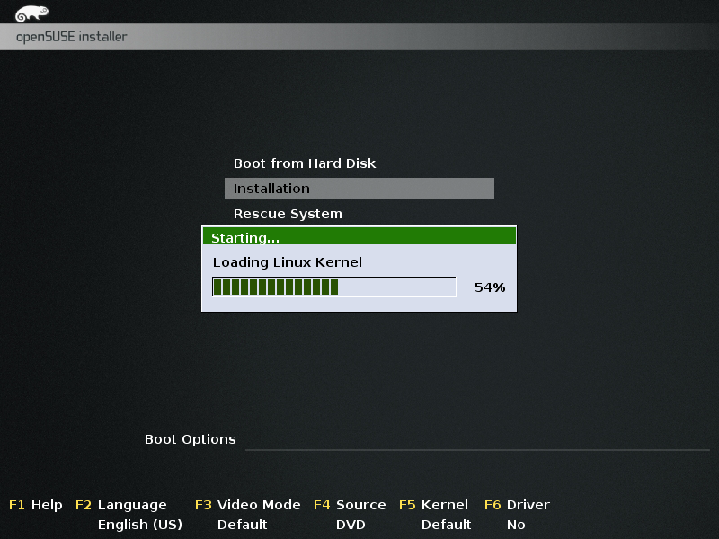

.. _os:

Operating System
****************

Installation
============
Once you have configured the computer system, the next step is to install the operating system `openSUSE 13.1 <https://en.opensuse.org/Portal:13.1>`_.
To do this, you only have to follow the instructions found `here <https://en.opensuse.org/SDB:DVD_installation>`_.

Basically, the steps are:

Boot
----
Insert the openSUSE13.1 x64 DVD into the DVD drive and restart the computer. After the power-on self test (POST), 
the boot screen should appear. Use the keyboard up and down buttons to select Installation and press enter to confirm.

.. note::

    The power-on self test (POST) can last several minutes, mainly because the kernel must recognize the PowerEdge RAID Controller (PERC) H710 card.
    

   

The kernel will load and some debugging messages may appear. These can usually be ignored unless there is an issue 
starting the installation. In that event, these messages may make debugging easier. 

Welcome
-------